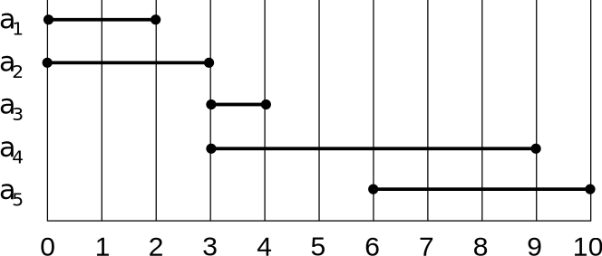

# Comp 251

> Jérôme Waldispühl &bull; [Course Webpage](https://www.cs.mcgill.ca/~jeromew/comp251.html) &bull; [Online Forum](https://osqa.cs.mcgill.ca/) &bull; [Algorithm Sorting Practice Questions](https://www.allanwang.ca/notes/mcgill/comp251/practice/)

## Big O

| | | | |
--- | --- | --- | --- 
Sorting | Typical | Θ(log n) | Heap sort, Merge sort, Bubble sort, etc 
Hasing | Insertion | O(1) | Add to beginning
| | Deletion | Seach time + O(1) | Using doubly linked list
| | Search | Worst: O(n)<br/>Expected: Θ(1 + α) | worst if all keys are in one slot <br/> α = n/m = #keys/#slots
Heaps | Typical | O(log n)
| | buildMaxHeap | O(n)
Red Black Trees | Typical | O(log n) | Balanced height is at most log n
Find/Union | Quick Find | O(1)
| | Union | O(log n)

Adjacency Representation

| | | | |
---|---|---|---
List | Search | Worst: Θ(V)
| | Storage | Θ(V + E)
Matrix | Storage Space | Θ(V<sup>2</sup>) 
BFS, DFS, SCC | Total Runtime | Θ(V + E) | V = vertex set, E = edge set
Kruskal's Algorithm | Total | O(E logV) &rarr; O(logV) | Notice \|E\| &le; \|V\|<sup>2</sup>
Prim's Algorithm | Total | O(E logV) | with binary heaps <br/> O(E + V logV) with Fibonacci heaps
Dijkstra's Algorithm | Total | O(E logV) | with binary heaps <br /> O(E + V logV) with Fibonacci heaps
Gale Shapley | Total | O(n<sup>2</sup>) | Best case Ω(n)
Bipartite Matching | Runtime | O(nm) 
Weighted Interval Scheduling | Memoization | O(n logn) | O(n) if presorted
Dynamic Programming | Backtracking | O(n) | Usually, given each backtrack has constant time.
Needleman-Wunsch | Total | Θ(mn) | m, n are sequence lengths
| | Space | Θ(mn) 
| | Optimal Value Space | Θ(m + n) | Still with Θ(mn) runtime, but we cannot recover optimal alignment
Bellman-Ford | Total | O(VE) 
Knapsack Problem | Possible | Θ(nW) | W is integer weight
| | Space | Θ(nW) 

## Lecture 0 • 2017/01/05
* Office Hours Tues/Thu 1-2pm
* 40% for 5 assignments, 15% for midterm, 45% for final exam
* Midterm March 9 (one crib sheet permitted), during class time
* End of class April 11
* Final exam TBD

## Lecture 1 • 2017/01/10
* *** A significant portion of the lecture overlaps with comp 250, so I did not add much about it here ***
* `f(n)` is `O(g(n))` iff there exists a point n0 beyond which `f(n)` is less than some fixed constant times `g(n)` → for all `n ≥ n0`, `f(n) ≤ c * g(n)` (for some `c > 0`)
* Let `T1(n) = O(f(n))` & `T2(n) = O(f(n))`
  * `T1(n) + T2(n) = O(f(n))`
  * `T1(n) / T2(n)` is not necessarily `O(1)`; big O is not necessarily the tightest upper bound.
  `T1(n) = 3n & T2(n) = 2n` is an example.
* Heap – binary tree such that
  * For any node n other than the root, `key(n) ≥ key(parent(n))`
  * Let h be the height of the heap
    * First `h – 1` levels are full
    * At depth h, leaves are packed on the left side of the tree

## Lecture 2 • 2017/01/12
* Table S with n records of x
  * X is key, key[x] → satellite data
  * Insert(S, x): S ← S ∪ {x}
  * Delete(S, x): S ← S \ {x}
  * Search (S, k)
  * Direct Address Table – each slot/position corresponds to key in U
    * If x has key k, T[k] points to x
    * If T[k] is empty, represented by NIL
    * All operations O(1), but if #keys < #slots, lots of wasted space
  * Hash Table – reduce storage, resolve conflicts by chaining, ave O(1) search time, not worse case
  * Hashing with Chaining
    * Insertion – O(1) – insert at beginning
    * Deletion – search time + O(1) if we use doubly linked list
    * Search
* Worst case – O(n)
  * Time to computer has function + time to search the list
  * Assuming time to compute is O(1)
  * When all keys go on same slot
* Average – depends how keys are distributed
  * Load factor α = n/m n = #keys, m = #slots
    * Theorem – expected time of search is Θ(1 + α)
* O(1) if α < 1, O(n) if α is O(n)
* Proof – unsuccessful vs successful
* Successful search
  * 1/m probability of collision – after finding x have been inserted in hash table before x (ie we insert at head)
  * 1 + α/2 + α/(2n)
* Hash functions
  * A good hash function should uniformly distribute the keys into slots, and should not be affected by patterns in keys
  * Division method – `h(k) = kmod d`
    * D must be d chosen carefully, usually 2<sup>r</sup> where r is a prime not too close to a power of 2 or 10
    * Easy to implement, but division is slow
  * Multiplication method – <code>h(k) = (A kmod2<sup>w</sup>) >> (w – r)</code>
    * Extracted bits are in the middle of the binary key
* Open addressing
  * No chaining; if slot is not empty, try another has function
  * Collisions exist; resolved by adding another slot
  * We can delete elements in open address tables
  * Cannot store more records than total number of slots in table
  * Deletion is difficult
* Goal is uniform hashing – each key is equally likely to have any permutation as its probe sequence
* Theorems
  * Expected # of probes in unsuccessful search is at most `1/(1 - α)`
  * Expected # of probes in successful search is at most `1/α * log(1/(1 - α))`
* Probing
  * Linear – h(k, i) = (h’(k) + i)mod m
    * If slot is full, check next slot; tendency to create clusters
  * Quadratic probing – <code>h(k, i) = (h’(k) + c<sub>1</sub>i + c<sub>2</sub>i<sup>2</sup>)mod m</code>
    * Must ensure we have full permutation of <0, …, m – 1>
    * Secondary clustering – 2 distinct keys have same h’ value if they have same probe sequence
* Double hashing – <code>h(k, i) = (h<sub>1</sub>(k) + i * h<sub>2</sub>(k)) mod m</code>
  * <code>h<sub>2</sub>(k)</code> should be “relatively” prime to m to guarantee full permutation

## Lecture 3 • 2017/01/17
* Max heap – largest element stored at root; all children are smaller
* Min heap – smallest element stored at root; all children are bigger
* Heaps as array – `root = A[1], left[i] = A[2i], right[i] = A[2i + 1], parent[i] = A[i/2]`
* Height - # of edges on longest simple path from node to leaf
* Height of heap = height of root = Θ(log n)
* Basic operations are O(log n)
* <details>
  <summary>Heap Pseudocode (Comp 250)</summary>
  
  ```java
  /*
   * Priority Queues - each node is smaller than all of its descendents
   *      root is therefore the smallest element
   * Complete Binary Tree - binary tree with all levels above the lowest one full
   *      and with all elements in the lowest level as left as possible
   * Heaps can be visualized as trees, but can also be represented with arrays
   *      if we number the nodes 1 through n, starting from the root and travelling breadth first,
   *      the numbers will represent their indices in the array (0 is not used for convenience)
   *      the left child of node k is therefore at 2k, and the right child is at 2k + 1
   */

  public class Heap {

      //add element at end then reorganize with upHeap
      void add(E element) {
          Node cur = newLastNode() //Node on lowest level right of the last existing node
          cur.element = element
          while (cur != root && cur.element < cur.parent.element) {//Node is smaller than parent
              swapElement(cur, parent) //switch values
              cur = cur.parent //go up a level
          }
      }

      //remove root, replace with last node, then reorganize with downHeap
      E removeMin() {
          E min = root.element //this is the smallest element
          Node cur = root //just a name change; currently refers to root
          cur.element = getLastNode().element //Get element of rightmost node on last level
          getLastNode() = null //last node has moved and no longer exists
          while (cur.leftChild != null) { //if null, there are no children
              if (cur.leftChild.element < cur.element) {
                  swapElement(cur, cur.leftChild) //left child smaller; swap
                  cur = cur.leftChild
              } else if (cur.rightChild != null && cur.rightChild.element < cur.element) {
                  swapElement(cur, cur.rightChild) //right child smaller; swap
                  cur = cur.rightChild
              }
          }
          return min
      }

      /*
       * Equivalent methods but in an array implementation
       */
      void add(E element) {
          size++ //it is assumed the array can fit this size
          heap[size] = element //size matches last index as 0 is not used
          i = size //iterate through 'parent nodes'
          while (i > 1 && heap[i] < heap[i / 2]) {
              swapElements(heap[i], heap[i / 2])
              i /= 2
          }
      }

      /*
       * Create heap from unsorted list
       * Best case is O(n) -> already a heap
       * Worst case is O(nlogn) -> move every item at k floor(logk) steps up
       */
      Heap buildHeap(list) {
          heap = new Heap(list.size)
          for (E element : list)
              heap.add(element) //see method above; adds and reorganizes
          return heap
      }

      E removeMin() {
          E min = heap[1] //root; index 0 not used
          heap[1] = heap[size]
          heap[size] = null //element moved
          size--
          downHeap(1, size)
          return min
      }

      /*
       * Moves element at index i to appropriate position within the heap
       */
      void downHeap(i, size) {
          while (2 * i <= size) { //left child exists
              child = 2 * i
              if (child < size) { //right child exists
                  if (heap[child + 1] < heap[child]) //right child smaller
                      child++ //child is now indexed at smallest of the two children
              }
              if (heap[child] < heap[i]) { //child smaller than current
                  swapElements(heap[child], heap[i])
                  i = child
              }
          }
      }

      //you can actually use heaps to sort your values
      E[] heapSort(list) {
          heap = buildHeap(list)
          E[] sorted = new E[list.size + 1]
          for (i = 1 to list.size){
              sorted[size - i] = heap.removeMin() //add min from left to right
          }
          return sorted
      }

      //sort within same array
      E[] heapSort(E[] arr) {
          heap = buildHeap(arr)
          for (i = 1 to list.size){
              swapElements(heap[1], heap[size + 1 - i]) //smallest element of subarray is moved to the back
              downHeap(1, size - i) //shift root element down, bringing next smallest to root
          }
          return reverse(heap) //reverse for small to large
      }

      /*
      * Previous methods rely on add(E), which uses upHeap
      * As half the elements are on the bottom row, it is much more efficient to downHeap
      * We start at k = size/2 because all k's greater are already at smallest height
      * Algorithm is O(n)
      * t(n) = Sigma(i = 0 -> n)(height of node i) = n - log(n + 1)
      */
      buildHeapFast(list) {
          for(k = size/2; k >= 1; k--)
              downHeap(k, size)
      }
  }
  ```
  </details>
* Maintaining heap property
  * Fix offending node by exchanging value at node with larger of the values at its children
  * Recursively fix until there are no more offenses
* Running time of buildMaxHeap is O(n)
  * maxHeapify = O(log n); heap height = log n; <br/>
  $O \left( n \sum_{h=0}^{\lfloor log n \rfloor}\dfrac{h}{2^h} \right)$
* HeapSort is O(n logn)

## Lecture 4 • 2017/01/19
* BST search, insert, delete are Θ(h); h = height of BST
* Height(x) = 1 + max(height(x.left), height(x.right))
* A good BST is balanced, height = Θ(log n)
* A bad BST is unbalanced, height = Θ(n)
* AVL – self balancing BST – Adelson-Velsky & Landis
  * Height of one child is at most one greater than the other
  * Each node contains data to indicate which child is bigger, or if they have the same height
  * Rotations are used to maintain balanced properties
* Rotations
  * Remove zigzags
    * If a.left = b and b.right = c, rotate b leftwards
    * Result: a.left = c and c.left = b
  * Reattach children properly
    * If a.left = b, b.left = c, b.right = d, a.right = e, rotate b rightwards
    * Result: b.right = a, a.right = e, b.left = c
    * Reattach middle child (d) to right child or local root → a.left = d

## Lecture 5 • 2017/01/24
* Recursive equation for best case running time of function heapify on heap size of n? Ω(1)
* Red Black Trees
  * Always balanced height is O(logn) worst case operations are O(logn)
  * +1 bit per node for attribute color: red or black
  * Empty trees are black and will be referenced as nil
  * Properties
    * Every node is red or black
    * The root and every leaf is black
    * If a node is red, its children are black
    * For each node, all paths from the node to descendant leaves contain same number of black nodes (same black height)
  * Let
    * h(x) = # of edges in longest path to leaf
    * bh(x) = # of black nodes from x to leaf, not counting x and counting the leaf
    * Black height of RBT = bh(root)
  * Note
    * `h(x)/2 ≤ bh(x) ≤ h(x) ≤ 2bh(x)`
    * A subtree rooted at any node x has <code>≥ 2<sup>bh(x)</sup> – 1</code> internal nodes
    * A RBT with n internal nodes has height `≤ 2lg(n+1)` (proof by previous point)
* <details>
  <summary>Pseudocode</summary>

  ```java
  /*
   * Red Black Tree Implementation
   */
  public class RedBlackTree {

      /**
       * Inserts a node at its proper position and makes it red
       *
       * @param tree the red black tree
       * @param z    the node to insert
       */
      void insert(tree, z) {
          y = nil[tree] //initialize reference
          x = tree.root
          while (x != nil[tree]) {
              y = x
              if (z.key < x.key) x = x.left
              else x = x.right
          }
          //we've found the proper location; add z as child
          z.parent = y
          if (y == nil[tree]) tree.root = z
          else if (z.key < y.key) y.leftChild = z
          else y.rightChild = z

          /*
           * Node is now added
           * Proceed to check the three cases below
           * and continue "fixing" until the root is reached
           * Grandparent of x is x.parent.parent
           * Uncle of x is sibling of x.parent (other child of grandparent)
           */
      }

      /**
       * Uncle is red;
       * we will swap the colors of the parent, uncle, and grandparent,
       * which brings the conflict one level higher
       * we will assume that the grandparent exists
       *
       * @param z the node to insert
       * @return new potential conflict node
       */
      Node case1(tree, z) {
          //by properties, the grandparent must be black -> swap
          z.parent.parent.color = red
          //swap colors for red father and uncle
          z.parent.color = black
          z.uncle.color = black
          //Only conflict now is from grandparent and its parent
          return z.parent.parent
      }

      /**
       * Uncle is black, so we cannot swap it to red
       * We will also assume that z, z.parent, and z.parent.parent are not inline (one is left child, one is right)
       * We will now align them through rotation and proceed to case 3)
       * In this case, we shall assume that the
       * z.parent.parent.leftChild z.parent
       * And z.parent.rightChild = z
       *
       * @param z the node to insert
       * @return new potential conflict node
       */
      Node case2(z) {
          //this is simply a generic rotation
          p = z.parent
          z.parent = p.parent
          p.parent = z
          p.rightChild = z.leftChild
          z.leftChild = p
          return case3(z) //now that we have the proper arrangement
          //we will proceed to case3
      }

      /**
       * Uncle is black, z is inline with parent and grandparent
       * We shall assume that z and its parent are both left children to their respective parents
       *
       * @param z the node to insert
       * @return new potential conflict node
       */
      Node case3(z) {
          //swap colors for parent and grandparent
          z.parent = black
          z.parent.parent = red
          rotateRight(z, z.parent) //z will now be the parent
          z.color = black //z the local root is now black
          z.parent.color = red //z.parent the child is now red
          return z
      }
  }
  ```
  </details>

## Lecture 6 • 2017/01/26
* Disjoint Sets
* Connected components – set of nodes connected by a path
  * Every node in the set can be reached by every other node (path itself is irrelevant)
* Partition – set of objects split into disjoint subsets
  * The union of all sets will produce the original set
  * No two sets share a common node unless those sets are the same set; every set is disjoint from all the other sets
* Map vs Relation
  * Maps lay out a unidirectional property from elements in one set to the other
  * Relation defines a bidirectional connection (ie boolean matrix)
* Equivalence – i is equivalent to j if they belong to the same set (are connected)
* Reflexivity - `∀ a ∈ S, (a, a) ∈ R`
  * For all `u ∈ V`, there is a path of length 0 from u to u
* Symmetry - `∀ a, b ∈ S, (a, b) ∈ R ⇒ (b, a) ∈ R`
  * For al `u, v ∈ V`, there is a path from u to v iff there is a path from v to u
* Transitivity - `∀ a, b, c ∈ S, (a, b) ∈ R ∩ (b, c) ∈ R ⇒ (a, c) ∈ R`
  * For all `u, v, w ∈ V`, if there is a path from u to v and a path from v to w, there is a path from u to w
* ADT (abstract data type)
  * find(i) - returns representative of set that contains i 
  * sameset(i, j) - returns find(i) == find(j) 
  * union (i, j) - merges sets containing I and j 
    * Does nothing if they are already in the same set
* When merging trees, smaller tree should be merged below root of larger tree to minimize height; height will therefore only increase when the trees initially have the same height
  * Rank – upper bound on height of nodes
* Path Compression – make all nodes in find path direct children of root
* <details>
  <summary>Disjoint Set Pseudocode</summary>

  ```java
  /*
   * Pseudocode for Disjoint Set Optimization
   */
  public class Disjoint {

      /**
       * Finds root node of a subset containing i
       * Also undergoes path compression, where the nodes will become
       * direct children of the root
       *
       * Worst case is O(logn) (we can prove that the height is at most logn)
       *
       * @param i node contained in subset
       *
       * @return root node
       */
      Node find(i) {
          if (i.parent == i) return i //i is the root
          return i.parent = find(i.parent) //set parent of i to root & return the root
      }
  }
  ```
  </details>

## Lecture 7 • 2017/01/31

* Greedy Strategy – when offered a choice, pick the one that seems best at the moment in hopes of optimizing the overall solution
  * Prove that when given a choice, one of the optimal choices is the greedy choice; it is therefore always safe to make the greedy choice
  * Show all but one of the sub-problems resulting from the greedy choice are empty
* Activity Selection Problem
  * Given a set S of n activities, a<sub>1</sub>, a<sub>2</sub>, …, a<sub>n</sub>
    * With s<sub>i</sub> = start time of activity i
    * And f<sub>i</sub> = finish time of activity i
    * What is the maximum number of “compatible activities”?
      * 2 activities are compatible if their intervals do not overlap
      * We wish to return the biggest valid subset (there may be multiple solutions, but we’ll find one of them)
* Optimal Substructure
  * Let S<sub>ij</sub> = subset of activities in S that start after a<sub>i</sub> finished and finish before a<sub>j</sub> starts
    * <code>S<sub>ij</sub> = { a<sub>k</sub> ∈ S: ∀ i, j &nbsp; f<sub>i</sub> ≤ s<sub>k</sub> < f<sub>k</sub>, ≤ s<sub>j</sub> }</code>
  * <code>A<sub>ij</sub> =</code> optimal solution <code>= A<sub>ik</sub> ∪ {a<sub>k</sub>} ∪ A<sub>kj</sub></code>
* Greedy Choice
  * Let <code>S<sub>ij</sub> ≠ ∅</code>
  * Let am be an activity in <code>S<sub>ij</sub></code> where <code>f<sub>m</sub> = min{ f<sub>k</sub>: a<sub>k</sub> ∈ S<sub>ij</sub> }</code>
  * We know that a<sub>m</sub> is used in one of the optimal solutions
    * Take any optimal solution without am and replace the first activity with it; it is still a valid solution since f<sub>m</sub> ≤ all other finish times
  * S<sub>im</sub> = ∅, so choosing a<sub>m</sub> leaves S<sub>mj</sub> as the only nonempty subproblem
* Greedy Solution
  * Take the activity with the earliest finishing time and add it to the set. Continue with the remaining time frame (after the current finishing time) and repeat until there are no other valid activities.
* <details>
  <summary>Pseudocode</summary>

  ```java
  /**
   * Algorithm to select a subset containing the greatest number
   * of compatible activities, where two activities are compatible
   * when there are no time conflicts
   */
  public class MaxCountActivitySelector {

      /**
       * Recursively get a valid solution
       * called through recursiveSelector(S, 0, n+1)
       *
       * @param S set of all activities, in order of finish time
       * @param i index of latest added activity
       * @return set containing the activities in our solution
       */
      Set<Activity> recursiveSelector(S, i) {
          m = i + 1 //get index of next activity
          while (m < S.size && S[m].start < S[i].finish)
              m++ //find first activity in S with an index within (i, n+1]
          if (m < S.size) return S[m] + recursiveSelector(S, m) //got first element; find rest
          return null //no more valid activities, close off set
      }

      /**
       * Iteratively get a valid solution
       *
       * @param S set of all activities, in order of finish time
       * @return set containing the activities in our solution
       */
      Set<Activity> iterativeSelector(S) {
          result = emptySet
          currentFinish = -1 //at first we accept the very first activity with the first finish
          for (i = 0; i < S.size; i++) {
              if (S[i].start >= currentFinish) {//valid activity, add to set
                  Result += S[i]
                  currentFinish = S[i].finish //set new finish
              }
              //otherwise, activity starts before last one in set ends
              //cannot be added to the set, so continue searching
          }
          return result
      }
  }
  ```
  <details>
* Typical Steps
  * Cast optimization problem as one in which we make a choice resulting in a subproblem
  * Prove that there is always an optimal solution that makes the greedy choice
  * Show that greedy choice & optimal solution to subproblem &rArr; optimal solution
  * Make greedy choice & solve top-down
  * May preprocess input (eg sorting activities by finish time)
* Text Compression
  * Given a string X, efficiently encode X into a smaller string Y
    * Saves memory and/or bandwidth
  * Huffman encoding
    * Computer frequency f(c) for each character c
    * Encode high-frequency chars with short code words
    * No code word is a prefix for another code
    * Use optimal encoding tree to determine code words
  * Terms
    * Code – mapping of char to binary
    * Prefix code – binary code such that no code-word is prefix of another code-word
    * Encoding tree – tree representing prefix code
      * Each leaf stores a character (other nodes do not have chars)
      * Code word given by path from root to external node
        * Left child = 0, right child = 1
* <details>
  <summary>Pseudocode</summary>

  ```java
  /**
   * Huffman's Algorithm for encoding Strings
   *
   * Runs in O(n + d logd)
   * Where
   *  n   size of X
   *  d   # of distinct characters X
   *
   * Uses heap-based priority queue
   */
  public class Huffman {
  
      /**
       * Generate trie representing encoding
       *
       * Basic procedure:
       * Get the two chars with the smallest frequencies
       * Make a node with those two chars as children
       * & with its valud being the summation of the two frequencies
       * Repeat with the remaining chars and the new node(s)
       * Once there is one node with all the chars mapped out,
       * you have found your trie
       *
       * @param X string input to encode
       * @return generated trie
       */
      Trie generateEncodingHeap(X) {
          Q = new Heap //empty max heap
          freq = distinctCharactersWithFrequencies(X)
          //maps each distinct char in X with its frequency in X
  
          for (CharFreq c : freq) { //for every unique char
              T = new Node(c.char) //make node storing the char
              Q.insert(c.frequency) //insert node at position relative to frequency
          }
          while (Q.size > 1) {
              f1 = Q.minKey() //get smallest frequency
              t1 = Q.removeMin() //get char with that frequency & remove it
              f2 = Q.minKey() //get next smallest frequency
              t2 = Q.removeMin() //get char with that frequency & remove it
              T = join(t1, t2) //combine two into one node
              Q.insert(f1 + f2, T) //add back to heap at their combined frequency location
          }
          return Q.removeMin() //return the resulting data
      }
  
  }
  ```

  </details>

## Lecture 8 • 2017/02/02

* Graph G = (V, E)
  * V – set of vertices
  * E – set of edges &sube; (V x V)
* Types
  * Undirected – edge (u, v) = (v, u) & there are no self loops
  * Directed – (u, v) is edge from u to v, or u &rarr; v; self loops allowed
  * Weighted – each edge has associated weight, given as a function w: E &rarr; R
  * Dense – |E| &asymp; |V|<sup>2</sup>
  * Sparse – |E| << |V|<sup>2</sup>
* |E| = O(|V|<sup>2</sup>|)
* Properties
  * If (u, v) &isin; E, then vertex v is adjacent to vertex u
    * Symmetric (reverse applies) if G is undirected
    * Not necessarily true if G is directed
  * If G is connected
    * There is a path between every pair of vertices
    * |E| &ge; |V| – 1
    * If |E| = |V| – 1, G is a tree
* Vocabulary
  * Ingoing edges of u: { (v, u) &isin; E }	edges pointing directly to u
  * Outgoing edges of u: { (u, v) &isin; E }	edges pointing directly out from u
  * In-degree(u): |in(u)|
  * Out-degree(u): |out(u)|
* Representations
  * Adjacency Lists
    * Array Adj of |V| lists
    * Every vertex has a list of adjacent vertices
    * If weighted, store weights within the adjacency lists
    * Space efficient when graph is sparse
    * Determine if edge (u, v) &isin; E is not efficient
      * Needs to search in u’s adjacency list. &Theta;(degree(u)) time
      * &Theta;(V) in worst case
  * Adjacency Matrix
    * |V| x |V| matrix A
    * A[i, j] = a<sub>ij</sub> = (i, j) &isin; E ? 1 : 0
* Can store weights instead of bits for weighted graphs
    * A = A<sup>T</sup> for undirected graphs
    * Space is &Theta;(V<sup>2</sup>) – not efficient for sparse graphs
    * Time to list all vertices adjacent to u: &Theta;(V)
    * //bigo
* [BFS DFS Pseudocode (Comp 250)](https://www.allanwang.ca/notes/comp/?scroll_to=tree-traversal) <!-- TODO update link? -->
* BFS – breadth-first search
  * Find all vertices on level n before proceeding to n + 1
  * Vertex is <i>discovered</i> the first time it is encountered during search
  * Vertex is <i>finished</i> if all vertices adjacent to it have been discovered
  * Colours
    * White – undiscovered	Gray – discovered & not finished	Black – finished
  * Result (given the graph G = (V, E) and source vertex s &isin; V)
    * d[v] = smallest # of edges from s to v for all v &isin; V
    * &infin; if v is not reachable from S
    * &pi;[v]  = u such that (u, v) is last edge on shortest path s to v
* u is v’s predecessor
  * breadth first tree with root s containing all reachable vertices
  * Time Complexity | |
    --- | ---
    Initialization	| Θ(V)
    Enqueue/Dequeue	| O(1)
    Total Runtime	| O(V + E)
* DFS – depth-first search
  * Explore all edges out of most recent vertex v before backtracking and exploring other vertices
  * Continue until all reachable vertices from original source are discovered
    * If any undiscovered vertices remain, pick one as a new source and repeat DFS
  * Result (given the graph G = (V, E) and source vertex s &isin; V)
    * 2 timestamps on each vertex, with integer values b/t 1 & 2|V|
    * d[v] = discovery tie (v turns from white to gray)
    * f[v] = finishing time (v turns from gray to black)
    * &pi;[v] = predecessor of v = u, such that v was discovered during scan of u’s adjacency list
  * Time Complexity | |
    --- | ---
    Loops	| Θ(V)
    Total Runtime	| Θ(V + E)
* Parenthesis Theorem
  * Theorem 1 – for all u, v, exactly one of the following holds
    * `d[u] < f[u] < d[v] < f[v] or d[v] < f[v] < d[u] < f[u]`
* And neither u nor v is a descendant of the other
    * `d[u] < d[v] < f[v] < f[u]`
* And v is a descendant of u
    * `d[v] < d[u] < f[u] < f[v]`
* And u is a descendant of v
  * `d[u] < d[v] < f[u] < f[v]` cannot happen

## Lecture 9 • 2017/02/07
* White-path Theorem
  * Theorem 2 – v is a descendant of u iff at time d[u], there is a path u → v consisting of only white vertices (except for u, which was just colored gray)
  * Classification of Edges | |
    ---|---
    Tree Edge |	In depth-first forest (paths taken in DFS); found by exploring (u, v) <br/> white
    Back Edge | (u, v), where u is descendant of v (in depth-first tree); forms cycles w/ tree edges; self loops are back edges <br/> grey
    Forward Edge | (u, v), where v is descendant of u, but not tree edge <br/> black
    Cross Edge | Any other edge; can go between vertices in same or different depth-first tree(s) <br/> black
  * Theorem 3 – in DFS of undirected graph, we get only tree & back edges; no forward or cross edges
* DAG – Directed Acyclic Graph
  * Graph without cycles
  * Good for modeling processes & structures with partial order
    * `a > b & b > c &rArr; a > c`
    * Not all orders are in graph
  * Can always make total order (valid comparison for all unique item pairs) from partial order (may not be unique; but is existing)
  * Lemma 1 – directed graph G is acyclic iff a DFS of G yields no back edges
* DAG to list – finding valid total order
  * Use DFS with timestamps (starting from any node)
  * Add item to the front of the list when it is finished
  * You will notice that the finishing time is strictly decreasing
  * Correctness proof – if (u, v) &isin; E, then f[v] < f[u]
* SCC – Strongly Connected Components
  * G is strongly connected if every pair (u, v) &isin; G is reachable from one another
  * Is a maximal set of vertices C &sube; V such that &forall; u, v &isin; C, u &rarrw; v & v &rarrw; u exist
* Component Graph
  * G<sup>SCC</sup> = (V<sup>SCC</sup>, E<sup>SCC</sup>)
  * V<sup>SCC</sup> has one vertex for each SCC in G
  * E<sup>SCC</sup> has an edge if there is an edge between the corresponding SCC’s in G
* G<sup>SCC</sup> is a DAG
* Lemma 2 – for two distinct SCC’s in G, if there is a path connecting SCC<sub>1</sub> to SCC<sub>2</sub>, there cannot be a path connecting SCC<sub>2</sub> to SCC<sub>1</sub><br>Otherwise, they will not be separate SCC’s
* Transpose of Directed Graph
  * G<sup>T</sup> = transpose of directed G
    * G<sup>T</sup> = (V, E<sup>T</sup>), E<sup>T</sup> = {(u, v): (v, u) &isin; E}
    * G<sup>T</sup> is G with all edges reversed
  * Creation time of &Theta;(V + E) using adjacency lists
  * G & G<sup>T</sup> have same SCC’s
* SCC Algorithm
  * SCC(G) – &Theta;(V + E)
  * Call DFS(G) to find f[u] for all u
  * Compute G<sup>T</sup>
  * Call DFS(G<sup>T</sup>) using decreasing f[u] order (found in first DFS)
    * Start with some x &isin; C such that f(C) is maximum
  * Output vertices in each tree of the depth-first forest formed in second DFS as separate SCC
  * Works because we are visiting vertices of component graph in topologically sorted order
    * Running DFS on G<sup>T</sup> means we will not visit any v from u where v & u are in different components
    * Can only reach vertices in its SCC and vertices in SCC's already visited in second DFS
  * Lemma 3 – let C & C’ be distinct SCC’s in G = (V, E); if (u, v) &isin; E &cap; u &isin; C &cap; v &isin; C’, then f(C) > f(C’)
    * Corollary – if (u, v) &isin; E<sup>T</sup>, f(C) < f(C’)

## Lecture 10 • 2017/02/09
* MST – Minimum Spanning Tree
  * Has |V| –  edges
  * Has no cycles
  * Might not be unique
* Generic algorithm
  * Start with empty set
  * While A is not a spanning tree, find a safe edge (u, v) and add it to A
  * Results in A, which is a subset of some MST
* Definitions
  * A <i>cut</i> partitions vertices into disjoint sets, S & V – S
  * An edge <i>crosses</i> a cut if one endpoint is in S & the other is in V – S
  * A <i>light</i> edge is the cross edge with minimal weight (may not be unique)
  * A cut <i>respects</i> A iff no edge in A crosses cut
* Theorem 1 – safe edge – let (S, V – S) be any cut that respects A; the light edge (u, v) crossing the cut is safe for A
* Kruskal’s Algorithm
  * Starts with each vertex in its own component
  * Repeatedly merge two components into one by connecting them through a light edge
  * Scans set of edges in monotonically increasing order by weight
  * Uses disjoint-set data structure to determine whether an edge connects vertices in different components
  * Time Complexity | |
    ---|---
    Initialize A | O(1)
    First for loop | |V| MAKE-SETs
    Sort E | O(E logE)
    Second for loop | O(E) FIND-SETs and UNIONs
    Total | O(E logV)
    
    * \* Notice that |E| &le; |V|<sup>2</sup> &rArr; O(logE) = O(2logV) = O(logV)
* Prim’s Algorithm
  * Builds one tree, so A is always a tree
  * Start from arbitrary "root" r
  * For each step, add light edge crossing cut (V<sub>A</sub>, V – V<sub>A</sub>) to A
    * V<sub>A</sub> = vertices A is incident on
* Finding light edge
  * Use priority queue Q (which supports the following in O(log n)
    * Insert(Q, u, key) – insert u with key value <i>key</i> in Q
    * u = extractMin(Q) – extract item with minimum key value in Q
    * decreaseKey(Q, u, newKey) – decrease u’s key value to newKey
  * Each object in Q is vertex in V – V<sub>A</sub>
  * Key of v has minimum weight of any edge (u, v) where u &isin; V<sub>A</sub>
  * Vertex returned is v where (u, v) is light edge crossing (V<sub>A</sub>, V – V<sub>A</sub>) where u &isin; V
  * If such a v does not exist, the weight is infinity
  * <details>
    <summary>Pseudocode</summary>

    ```java
    /**
     * Prim's Algorithm for finding MST (minimum spanning tree)
     * Complexity
     * Using binary heaps       O(E logV)
     * Initialization           O(V)
     * Building initial queue   O(V)
     * V extractMin             O(V logV)
     * E decreaseKey            O(E logV)
     * Fibonacci heaps          O(E + V logV)
     */
    public class Prim {
    
        MST findMST(graph, root) {
            MST mst = new MST()
            Q = new Queue(graph) //create queue with every vertex in graph
            //set keys to infinity for all nodes
            for (Node u : Q) {
                u.key = INFINITY //key of vertex
                u.pi = NIL //no predecessor yet
                insert(Q, u) //add to queue
            }
            decreaseKey(Q, root, 0) //start with arbitrary root; weight is 0
            while (!Q.isEmpty()) { //loop until Q is empty
                u = extractMin(Q)
                for (Vertex v : u.adjacentVertices) {
                    if (v.isin(Q) && weight(u, v) < v.key) { //update adjacent nodes
                        v.pi = u //set predecessor of v
                        decreaseKey(Q, v, weight(u, v)) //set new weight for v
                    }
                }
                mst.add(u) //add lowest weight to mst
            }
            return mst
        }
    }
    ```
    </details>

## Lecture 11 • 2017/02/14
* Shortest path u to v contains the smallest weight sum of all the edges in that path (compared to any other valid path from u to v)
* Variants
  * Single-source – shortest path from given source vertex to every other vertex &isin; V
  * Single-destination – shortest paths to given destination vertex
  * Single-pair – shortest path from u to v
  * All-pairs – find shortest path from u to v for all u, v &isin; V
* Negative weight edges
  * Can be problematic
  * If there is a negative-weight cycle, we can keep going around it, resulting in w(s, v) = -&infin;
  * Only problematic if reachable from source
  * Some algorithms work only if there are no negative-weight edges; must specify
* Cycles
  * Shortest paths cannot contain cycles
  * Cycles cannot have negative-weight
  * Assume cycles do not have zero-weight
  * Cycles with positive weights will add to the path length, so we can shorten it by omitting the cycle
* Lemma – any subpath of a shortest path is a shortest path
* Algorithm output (for each vertex v &isin; V)
  * d[v] = &delta(s, v)
    * initially &infin;
    * reduces as algorithm progresses, but is always &ge; &delta;(s, v)
    * known as a shortest-path estimate
  * &pi;[v] = predecessor of v on shortest path from s
    * Nil if no predecessor
    * Induces a tree &rarr; shortest-path tree
* Triangle inequality
  * For all (u, v) &isin; E, &delta;(u, v) &le; &delta;(u, x) + &delta;(x, v) 
  * Shortest path u &rarrw; v &le; weight of any other path u &rarrw; v
* Upper bound property
  * d[v] always &ge; &delta;(s, v) for all v
  * if d[v] = &delta;(s, v), it will never change
* No-path property
  * If &delta;(s, v) = &infin;, d[v] is always &infin;
* Convergence property
  * If s &rarrw; u &rarr; v is shortest path, d[u] = &delta;(s, u)
  * After relax(u, v, w), d[v] = &delta;(s, v)
* Path-relaxation property
  * If relax all edges in a path from s to v in order, d[v] = &delta;(s, v)
* Dijkstra’s algorithm
  * No negative-weight edges
  * Weighted version of BFS
    * Priority queue instead of FIFO (first in, first out) queue
    * Keys are shortest-path weights (d[v])
  * Two sets of vertices
    * S – vertices whose final shortest-path weights are determined
    * Q – priority queue – (V – S)
  * Greedy – choose light edge at each step
  * <details>
    <summary>Pseudocode</summary>

    ```java
    /**
     * Pseudocode for finding shortest path
     */
    public class ShortestPath {
    
        /**
         * Setup default vars
         *
         * @param V graph
         * @param s source vertex
         */
        void initSingleSource(V, s) {
            for (Vertex v : V) {
                d[v] = INFINITY
                pi[v] = NIL
            }
            d[s] = 0 //source weight is always 0
        }
    
        /**
         * Relaxing an edge (setting minimum weight)
         *
         * @param u start vertex
         * @param v end vertex
         * @param w new weight from u to v
         */
        void relax(u, v, w) {
            if (d[v] > d[u] + w(u, v)) { //better weighting found
                d[v] = d[u] + w[u, v]
                pi[v] = u //set predecessor
            }
            //otherwise, keep original weighting
        }
    
        /**
         * Dijkstra's algorithm to find shortest path
         * Must have non negative weightings
         *
         * If binary heap, each operation takes O(log V) -> O(E logV)
         * With Fibonacci heaps, O(V logV + E)
         *
         * @param V all the vertices
         * @param E all the edges
         * @param w all the weightings
         * @param s source vertex
         * @return set of all vertices with their deltas and predecessors
         */
        Set dijkstra(V, E, w, s) {
            initSingleSource(V, s);
            S = new Set() //create empty set
            Q = V //move all vertices to Q
            while (!Q.isEmpty()) {
                u = extractMin(Q)
                S = S.add(u)
                for (Vertex v : u.adjacentVertices) {
                    relax(u, v, w) //lower weighting if possible
                }
            }
            return S
        }
    }
    ```
    </details>

## Lecture 12 • 2017/02/16
* Bipartite graph – graph where vertices can be partitioned into 2 sets (A & B), where all edges cross the sets (no edges are from one set to the same set)
  * If made into a DFS tree, can be coloured in 2 colours where every edge spans from one colour to the other colour
  * Is bipartite iff it does not contain an odd cycle
  * [From Math 240](https://www.allanwang.ca/pdf/MATH-240.pdf#page=36) <!-- TODO relink -->
* Matching – subset of edges such that no two edges share a vertex
* Perfect matching – every vertex in subset A has a matching in subset B and vice versa
* Complete bipartite graph – every vertex in A is connected to every vertex in B and vice versa
* Stable marriage problem
  * Goal is to find perfect matching
  * Pair is unstable if for an unmatched pair &alpha;-&beta;, &alpha; prefers &beta; to current match, and &beta; prefers &alpha; to current match
  * Matchings are stable if there are no unstable pairs
  * <details>
    <summary>Pseudocode</summary>

    ```java
    /**
     * Gale-Shapley Algorithm for finding stable marriage solution
     */
    public class GaleShapley {
    
        /**
         * find stable matches
         * sets contain items that have an ordered preference
         * for the items in the other set
         *
         * O(n^2)
         * Best case Omega(n)
         *
         * @param A set A
         * @param B set B
         * @return matching pairs
         */
        Matching findMatches(A, B) {
            M = new Matching()
            while (A.hasUnmatched()) {
                a = A.getFirstUnmatched() //get an unmatched item
                b = a.orderedPrefs.removeFirst() //get first preference of that item
                if (!b.isMatched()) {
                    M.add(a, b) //unmatched, add the matches
                } else {
                    c = b.match //get b's current match
                    if (b.prefers(a, c)) {
                        //a is preferred, remove old matching
                        M.remove(c, b).add(a, b)
                    }
                }
            }
            return M
        }
    
    }
    ```
    </details>  

## Lecture 13 • 2017/02/21 
* Flow Network
* G = (V, E) directed
* Each edge (u, v) has capacity c(u, v) &ge; 0
* Edges are also known as arcs
* If (u, v) &notin; E, c(u, v) = 0
* Source vertex s, sink vertex t, s &rarrw; v &rarrw; t for all v &isin; V
* Positive flow p(u, v)
  * When annotated, an edge is given the values p(u, v) / c(u, v) (eg 1/2)
* Capacity constraint – 0 &ge; p(u, v) &ge; c(u, v)
* Skew symmetry – c(u, v) = -c(u, v)
* Flow conservation – positive flow into vertex = positive flow out of vertex
* Cancellation with positive flows
  * Without loss of generality, we can say positive flow goes either from u to v or from v to u, but not both
  * Eg if p(u, v) = 5 & p(v, u) = 3, it is equivalent to a flow of 2 from u to v
  * We denote this as f(u, v) = p(u, v) – p(v, u) &ensp;&ensp;p(u, v) &ge; 0
* Total flow of graph (|f|) is sum of all flows from source or all flows to sink
  * All vertices in between satisfy flow conservation
* Naïve algorithm for maximal flow
  * Find a path and add the maximum flow for that path
  * Repeat until no path can have additional flow
  * Not good because our result depends on which path we fill first; not always correct
* Residual graphs – used to find maximal flow
  * Given G = (V, E) with edge capacities c & flow f, we define residual graph G<sub>f</sub> as
    * Having the same vertices as G
    * Having edges E<sub>f</sub> with residual capacities c<sub>f</sub> where we can add or subtract flow from edges e &isin; E
  * For each edge e = (u, v) &isin; E
    * If f(e) < c(e), add forward edge (u, v) in E<sub>f</sub> with residual capacity c<sub>f</sub>(e) = c(e) – f(e)
    * If f(e) > 0, add backward edge (v, u) in E<sub>f</sub> with residual capacity c<sub>f</sub>(e) = f(e)
    * Example (note that sometimes one edge can result in both a forward and a backward edge)
      | | | | |
      ---|---|---|---
      f(e) | c(e) | forward | backward
      0 | 1 | 1 | 0
      1 | 1 | 0 | 1
      2 | 3 | 1 | 2
* Augmenting path – path from source s to sink t in residual graph G<sub>f</sub> that allows us to increase flow
* To use residual graphs to find maximal flow
  * Compute residual graph G<sub>f</sub>
  * Find a path P
  * Augment flow f along path P
  * Let &beta; be bottleneck; add to f(e) on edge of P
    * Add if forward edge, subtract if backward edge
* Ford-Fulkerson algorithm
  * While there is still a s-t path in G<sub>f</sub>, augment f to P (see above)
  * Update G<sub>f</sub> and continue
  * Algorithm terminates because bottleneck &beta; is strictly positive and flow is bounded (flow will not surpass bound)
  * Time Complexity
    * Let C = &Sigma;c(e) &emsp;&emsp;&emsp;&emsp;e &isin; E outgoing from s
    * Finding s-t path takes O(|E|) (eg BFS or DFS)
    * Flow increases by at least 1 at each iteration
    * Algorithm runs in O(C * |E|)

## Lecture 14 • 2017/02/23
* s-t cut of flow network is cut(A, B) such that s &isin; A and t &isin; B
  * capacity is the &Sigma;c(e) for all edges e the cut crosses
  * flow is |f| = f<sup>out</sup>(A) – f<sup>in</sup>(A)
    * |f| is bounded by &Sigma;c(e) for all e &isin; cut(A, B)
* Observations
  * Every flow must be &le; capacity of every s-t cut
  * Value of maximum flow is less than capacity of minimum cut
* Flow in Ford-Fulkerson
  * Terminates when no augmenting path in residual graph G<sub>f</sub>
  * |f| = &Sigma;c(e)
    * In particular, f<sup>out</sup>(A) = &Sigma;c(e) and f<sup>in</sup>(A) = 0
    * Since v cannot be reacahable from s in G<sub>f</sub>, there cannot be any resulting forward or backward edges
  * For any e = (u, v) &isin; cut(A, B), f(e) = c(e)
* Computing min cut
  * Find G<sub>f</sub> with Ford-Fulkerson
  * Run BFS or DFS of s
  * Reachable vertices define set A for the cut
  * Recall that min cut is minimum number of cuts needed to stop all flow from s to t
* Bipartite matching with network flows
  * With bipartite with sets A and B
  * Connect s to every vertex in A
  * Keep directed edges from A to B
  * Connect every vertex in B to t
  * Get max flow with Ford-Fulkerson &rArr; max matching
* Running time
  * General complexity if O(C * |E|)	C = &Sigma;c(s, u)
  * If |A| = |B| = n, C = |A| = n, |E’| = |E| + 2n = m + 2n
  * Given m > n, O(n * (m + 2n)) = O(nm)

## Midterm Review • 2017/03/07 
* Focus on direct application of concepts
* 1 proof in the midterm
* Nothing on probability
* Be comfortable with running time
* Proofs
  * Contradiction – assume opposite and prove that it is false
  * Cut & paste – used with graphs & greedy algorithms
    * Assume sub-problem is not optimal, and replace with optimal solution to show contradiction
  * Loop invariants – prove that loop structure is doing what it is intended to do
    * Must specify loop invariant property, initialization, maintenance (conserving property), termination (loop stops)
* Hashing
  * Different types
  * Conflict resolution
  * Open addressing
  * Linear & quadratic probing
* BST
  * Rotation
  * Self-balanced trees (AVL, RBT)
    * How to do operations (insertion)
* Greedy algorithms
  * Activity-selection problem
* Graph algorithms
  * Topological sort – get total order from partial order
    * Can be found from DAG
  * BFS, DFS
  * **MST, Kruskal, Ford-Fulkerson, Dijkstra**
  * Cut (respect, light, cross)
  * Safe edge
* Bipartite graphs
  * Stable pairs
* Network flow
  * Positive flow, capacity constraint, flow conservation

## Lecture 15 • 2017/03/14
* Algorithm paradigms
  * Greedy – decompose & reduce problem – top-down approach
  * Dynamic programming – solve all possible sub-problems and use solutions to solve larger problems – bottom-up approach
* Going back to the activity selection problem: given activities, find subset with greatest total activity duration, where no two activity intervals overlap
  * Greedy algorithm ([Lecture 7](#Lecture-7-•-2017/01/31)) doesn’t always work, eg activities (0, 2), (1, 8), (7, 9)
    * Greedy would pick (0, 2) & (7, 9) whereas the best solution is (1, 8)
  * Binary choice
    * Let OPT(j) denote the best solution for activities 1 to j
    * Let p(j) denote the largest index i < j such that activity i is compatible with activity j
    * Case 1: j is in the optimal solution
      * Compute weight<sub>j</sub> + OPT(p(j))
    * Case 2: j is not in optimal solution
      * Compute OPT(j – 1)
    * The maximum of the two cases denotes the optimal solution up to j
    * If we draw out the recursive calls, we’ll notice that we often compute values of OPT(i), where i < j, multiple times. Instead, we can compute those values once, store them, and reuse them next time.
    * Also notice that every OPT(j) depends only on OPT values at indices < j
* Memoization – cache results of each subproblem; lookup as needed
* Running time – O(n logn)
  * Sort by finishing time O(n logn)
  * Compute p(*) O(n logn)
  * Compute OPT once O(1) (either return existing value or existing value and one sum)
    * At most 2n recursive calls, O(n)
* Note that running time is O(n) for jobs presorted by start & finishing times
* Dynamic programming goal – solve sub-problems in order so that once you reach larger problems, the sub-solutions are already computed
* However, after the call, the algorithm computes the optimal value, not the activity set
  * We may find the solution by backtracking
  * For every potential j, if weight<sub>j</sub> + OPT(p(j)) > OPT(j – 1), j is included in the set
  * Keep checking previous activities to find full set
* <details>
  <summary>Pseudocode</summary>

  ```java
  /**
   * Pseudocode for finding max weight activity set
   */
  public class DynamicProgramming {
  
      int[] M //holds OPT
      int[] w //holds weight of activity
      int[] p //holds latest valid predecessor
  
      /**
       * Finds the max possible weight;
       * fills arrays above in the process
       *
       * @return max weight
       */
      int findMaxWeight() {
          M.setAllValueTo(EMPTY)
          M[0] = 0
          return findMaxWeight(M.length - 1)
      }
  
      int findMaxWeight(j) {
          if (M[j] == EMPTY)
              M[j] = max(v[j] + findMaxWeight(p[j]), findMaxWeight(j - 1))
          return M[j]
      }
  
      /**
       * Find the activity set given the completion of the arrays above
       *
       * @param j index of activity in question (start at last index)
       * @return optimal set
       */
      int[] findSolution(j) {
          if (j == 0) return []
          if (w[j] + M[p[j]] > M[j - 1]) return findSolution(p[j]) + [j]
          return findSolution(p[j - 1]) //j is not in solution set
      }
  }
  ```
  </details>
* Example
  | | | | | | |
  ---|---|---|---|---|---
  activity | 1 | 2 | 3 | 4 | 5
  predecessor | 0 | 0 | 2 | 2 | 3
  Best weight M | 2 | 3 | 4 | 9 | 9
  V<sub>j</sub> + M[p(j)] | 2 | 3 | 4 | 9 | 8
  M[j - 1] | 0 | 2 | 3 | 4 | 9
<br/><br/>
  * Reconstruction yields a<sub>2</sub> & a<sub>4</sub>

## Lecture 16 • 2017/03/16
* Pairwise Sequence Alignment
  * Goal: Map letters between two strings (a & b) such that the “distance” (see below) between the strings are minimized
  * Letters must remain in order, but spaces can be added between them
* Definitions
  * Match – letters are identical
  * Substitution – letters are different
  * Insertion – letter of b is mapped to empty character
  * Deletion – letter of a is mapped to empty character
  * Indels – group covering insertions & deletions
* Can be used to find similarities in amino acid sequences
* Counting alignments
  * We may observe that the alignments of a and b must end by (a, -), (a, b), or (-, b) (deletion, match/substitution, insertion)
  * If we define c(m, n) as the # of alignments formed between them, we see that c(m, n) = min(c(m – 1, n), c(m – 1, n – 1), c(m, n – 1))
  * Base case – f(0, n) = f(m, 0) = f(0, 0) = 1
* Levenshtein Distance
  * Minimal # of substitutions, insertions & deletions to transform one into the other
  * Each of those actions adds one to the total distance
* Edit distance
  * If every edit operation has a positive cost & an inverse operation with equal cost, the edit distance is metric
  * d(x, y) &ge; 0 (separate axiom)
  * d(x, y) = 0 iff x = y (coincidence axiom)
  * d(x, y) = d(y, x) (symmetry)
  * d(x, y) &le; d(x, z) + d(z, y) (triangle inequality)
* Optimal sub-structure – sub-alignment of optimal alignments are also optimal
  * Cut-and-paste proof
* Backtracking 
  * Each move associated with one edit operation
    * Vertical – insertion 
    * Diagonal – match/substitution
    * Horizontal –deletion
  * Find move that was used to find the value of the cell
  * Apply recursively
* Analysis
  * Comparing two strings of length m & n is &Omega;(mn) time and &Omega;(mn) space
  * It’s easy to save space and compute values in &Omega;(m + n) space by computing OPT(i, *) from OPT(i – 1, *); however, recovering alignment is harder
* Example
  | | | | | | |
  ---|---|---|---|---|---
  \* | - | A | T | T | G
  \- | 0 | 1 | 2 | 3 | 4
  C | 1 | 1 | 2 | 3 | 4
  T | 2 | 2 | 1 | 2 | 3
* <details>
  <summary>Pseudocode</summary>

  ```java
  /**
   * Algorithm for finding the optimal sequence alignment for two strings
   */
  public class NeedlemanWunsch {
  
      String a, b //two strings to compare; for our sake, both string start with '-'
      //and the first real letter is at index 1
      int[][] d //matrix holding minimum distance up to two characters
  
      //get cost for two characters
      int delta(m, n) {
          return m == n ? 0 : 1
      }
  
      /*
       * Compute lowest distance and store values for backtracking
       */
      int getLowestDistance() {
          //map the borders (base case; assumption that one of the strings is empty)
          //therefore, distances will increase by one each time
          for (int i = 0; i < a.length(); i++)
              d[i][0] = i
          for (int j = 0; j < b.length(); j++)
              d[0][j] = j
          for (int i = 1; i < a.length(); i++)
              for (int j = 1; j < b.length(); j++)
                  d[i][j] = min(d[i - 1][j] + delta(a[i], '-'), //deletion
                          d[i - 1][j - 1] + delta(a[i], b[j]), //match/substitution
                          d[i][j - 1] + delta('-', b[j])) //insertion
          return d[a.length() - 1][b.length() - 1]
      }
  
      /*
       * Find match pairs between the two strings; set i & j to last index initially
       */
      Pair[] getSolution(i, j) {
          if (i == 0 || j == 0) return []
          delta = delta(a[i], b[j])
          if (d[i - 1][j] + delta(a[i], '-') == d[i][j])
              return [Pair(a[i], '-')] + getSolution(i - 1, j) //deletion occurred
          if (d[i - 1][j - 1] + delta(a[i], b[j] == d[i][j])
              return [Pair(a[i], b[j])] + getSolution(i - 1, j - 1) //match/substitution occurred
          return [Pair('-', b[j])] + getSolution(i, j - 1) //insertion occurred
      }
  }
  ```
  </details>

## Lecture 17 • 2017/03/21
* To add onto the pairwise sequencing from last lectures, the approach may be modified with different weightings to provide different results, eg 1 and -1 for delta in bioinformatics
* Dijkstra’s algorithm & negative weights
  * Weighted version of BFS – priority queue rather than FIFO queue
  * Greedy choice – picks lightest edge at each step
  * How do we deal with negative weight edges?
    * Re-insertion in queue leads to exponential running time
    * Adding constants to each edge to make them positive changes the question, because paths with different numbers of edges are incremented with different values
* Bellman-Ford algorithm
  * Allows negative-weights
  * Computer d[v] (shortest-path weights) and &pi;[v] (predecessors) for all v &isin; V
  * Return true if no negative-weight cycles are reachable form source, false otherwise
  * If Bellman-Ford has not converged after V(G) – 1 iterations, there cannot be a shortest path tree, so there must be a negative weight cycle (longest path w/o cycles is V(G) – 1 in length)
* <details>
  <summary>Pseudocode</summary>

  ```java
  /**
   * Find shortest path between two nodes in a graph
   * Allows for negative-weight edges and will catch negative cycles if they occur
   *
   * Time Complexity O(VE)
   */
  public class BellmanFord {
  
      /**
       * Check if shortest path exists
       *
       * @param G the graph
       * @param s source node
       * @return true if path exists, false otherwise (negative cycle)
       */
      boolean initialize(G, s) {
          for (int i = 0; i < G.size() - 1; i++)
              for (u, v in G.edges)
                  relax(u, v, w(u, v)) //set d[v] as min(d[v], d[u] + w(u, v))
          for (u, v in G.edges)
              if (d[v] > d[u] + w(u, v)) return false //mismatch found
          return true
      }
  }
  ```
  </details>
* Dynamic Programming in Bellman-Ford
  * Let d(i, j) = cost of shortest path from s to i with at most j hops
  * | Cases | |
    ---|---
    i = s & j = 0 | 0
    i ≠ s & j = 0 | &infin;
    j > 0 | 	min(d(k, j – 1) + w(k, i): i ∈ Adj(k), d(i, j – 1)) <br/> Either a valid predecessor's weight + current weight, or no change (achieved with fewer hops)

## Lecture 18 • 2017/03/23
* Divide & Conquer
  * Divide – split problems into smaller sub-problems
  * Conquer – solve sub-problems recursively, or use base cases
  * Combine – merge two sub-problems and eventually reach the original problem again
* Example – Merge Sort
  * Divide – split n-elements to subsequences of n/2 elements
  * Conquer – sort recursively using merge sort; once array has size 1, simply return that array
  * Combine – merge two sorted subsequences to produce sorted answer
* Multiplication – Divide & Conquer
  * For value x with n digits, let x<sub>L</sub> = x / 2<sup>n/2</sup>, and let x<sub>R</sub> = x % 2<sup>n/2</sup>
  * Instead of using grade school multiplication (O(n<sup>2</sup>)), we may compute x * y through their components <br/> <code>x * y = 2<sup>n</sup>x<sub>L</sub>y<sub>L</sub> + 2<sup>n/2</sup>(x<sub>L</sub>y<sub>R</sub> + x<sub>R</sub>y<sub>L</sub>) + x<sub>R</sub>y<sub>R</sub></code>

  # Lecture 19 • 2017/03/28
* Merge sort running time
  * T(n) = execution time for size n = 2 * T(n/2) + n (2 sub calls + merge time)
  * Binary Search T(n) = T(n/2) + 1
  * Karatsuba T(n) = 3 * T(n/2) + n
* Master Theorem – solves commond divide and conquer runtimes
  * General: T(n) = a(Tn/b) + f(n)
  * a &ge; 1: # of subproblems
  * b > 0: factor by which the subproblem size decreases
  * f(n): work to divide/merge subproblems
* Recursion tree
  * k: log<sub>b</sub>a
  * log<sub>b</sub>n: # of levels
  * a<sup>i</sup>: # of subproblems at level i
  * n/b<sup>i</sup>: size of subproblem at  level i
* Case 1 – cost dominated by cost of leaves
  * If f(n) = O(n<sup>k – &epsilon;</sup>) for some &epsilon; > 0
  * T(n) = &Theta;(n<sup>k</sup>)
  * Eg T(n) = 3T(n/2) + n &rarr; T(n) = &Theta;(n<sup>log<sub>2</sub>3</sup>)
* Case 2 – cost evenly distributed among levels
  * If f(n) = &Theta;(n<sup>k</sup>log<sup>p</sup>n)
  * T(n) = &Theta;(n<sup>k</sup>log<sup>p + 1</sup>n)
  * Eg T(n) = 2T(n/2) + &Theta;(n logn) &rarr; T(n) = &Theta;(n log<sup>2</sup>n)
* Case 3 – cost dominated by cost of root
  * If f(n) = &Omega;(n<sup>k + &epsilon;</sup>) for some &epsilon; > 0) and if a * f(n/b) &le; c * f(n) for some c < 1 &forall; sufficiently large n (holds if f(n) = &Theta; (n<sup>k + &epsilon;</sup>))
  * T(n) = &Theta;(f(n))
  * Eg T(n) = 3T(n/4) + n<sup>5</sup> &rarr; T(n) = &Theta;(n<sup>5</sup>)

## Lecture 20 • 2017/03/30
* Amortized analysis – analyzing run time through average cases
* Show that although some operations may be expensive, the average cost is small
* Methods
  * Aggregate analysis – split into cases with run times and compute the average
  * Accounting method – create a specific cost and use credits to fulfill all cases
  * Potential method
* We will start with using aggregate analysis
* Runtime of multipop(s, k), where s is he stack, and k is the maximum number of pops occurring (up until stack is empty if size < k)
  * Given a sequence of n push, pop, multipop operations:
  * We know that the worst-case cost of multipop is O(n) and push/pop cost 1
  * Therefore, worst-case of sequence is O(n<sup>2</sup>)
  * However, knowing that objects can only be popped once per each push, we know that there are under n pops/multipops possible; therefore, the true cost is O(n), and the average is O(1) per operation
* Number of flips needed for a binary counter
  * <details>
    <summary>Pseudocode</summary>

    ```java
    public class BinaryCounter {
        /**
         * Increments counter, where A is the array of bits
         * and k is the number of bits
         */
        void increment(A, k) {
            for (i = 0; i < k && A[i] == 1; i++)
                A[i] = 0
            if (i < k)
                A[i] = 1
        }
    }
    ```
    </details>
  * One might assume that incrementing takes O(nk) time, since there are n calls at up to k bits may be flipped, but that is an overshoot. All numbers ending with a 0, for example, only require one bit flip on the rightmost digit. We may find the following trend for the counters: 

    Bit | Flips how often
    ---|---
    0 | Every time
    1 | 1/2 of the time
    2 | 1/4 of the time
    &hellip; | &hellip;
    i | 1/2<sup>i</sup> of the time
    &hellip; | &hellip;
    i &ge; k | Never
  * As a result, the total cost is the summation 1 to 1/2<sup>k - 1</sup>, which is &le; 2, multiplied by n. This results in O(n) and a cost per operation of O(1)
* Accounting method – now, we will give different charges to different operations. Our amortized cost will be the amount we charge; if it’s greater than the actual cost, we will store the difference as credit. Credit can be used to pay for later operations where the actual cost > amortized cost, but the credit may not be negative at any point.
  * In other words, for every cost summation from i to n, the net amortized cost must be at least the sum of the actual costs.
  * For the case of multipop, we may define an amortized cost of 2 for push; 1 is for pushing the object, and 1 is for eventually removing it. Given that we can only pop or multipop values we’ve previously pushed, this extra cost will always cover any future actions, resulting in a total amortized cost of O(n)
  * For the binary counter, we may charge 2 to set a bit to 1; 1 is for actually changing it, and 1 is for changing it back to a 0 in the future. We may see from our pseudocode that for every increment, at most one 0 bit is changed into 1, so this amortized cost covers all future actions, resulting in O(n).

## Lecture 21 • 2017/04/04
* Global min cut – given connected undirected graph, find cut with minimum cardinality
  * Applications – partitioning items, identify clusters of related content, network reliability, TSP solver
  * Network solution – replace every edge (u, v) with 2 (directed) antiparallel edges (u, v) & (v, u)
    * Pick some vertex s, & compute min s-v cut for every other vertex v
* Contraction algorithm [Karger 1995]
  * Pick edge e = (u, v) randomly
  * Contract edge e
    * Replace u & v by single super-node w
    * Preserve edges, updating endpoints u & v to w
    * Delete self-loops
  * Repeat until graph has two nodes u<sub>1</sub> & v<sub>1</sub>
  * Return cut (all nodes that were contracted to form v<sub>1</sub>)
  * Notice that the cardinality of the cut is the number of edges connecting u<sub>1</sub> & v<sub>1</sub> at the last step
  * Claim – contraction algorithm returns min cut with a probability &ge; 2/n<sup>2</sup> (n = |V|)
    * At every step, |E’| &ge; 1/2 kn’, otherwise our min cut is not truly a min cut
    * Algorithm contracts edge in our min cut with probability &le; 2/n’
    * Combined, the probability that no edge in min cut is contracted is (1 – 2/n)(1 – 2/(n – 1)) * &hellip; * (1 – 2/4)(1 – 2/3) &ge; 2/n<sup>2</sup>
  * Amplification – increase odds of success by running contraction many times
  * Claim – if we repeat n<sup>2</sup>ln n times, probability of failing to find global min-cut &le; 1/n<sup>2</sup>
  * Slow running time, but we may notice that the odds of contracting a min edge is greater in the last iterations than the early ones; we can run the contraction algorithm twice when n/&radic;2 nodes remain and pick the best of the two cuts
  * Best known running time is O(mlog<sup>3</sup>n) [Karger 2000]
* Maximum 3-satisfiability
  * Given k 3-SAT formulas (eac formula has 3 distinct literals joined by or operators), find truth assignment that satisfies as many clauses as possible
  * NP-complete; simple idea is to flip a coin and set each variable to true with 1/2 probability
  * Claim – with k clauses, expected number of clauses satisfied by random assignment is 7k/8 (as long as one variable is actually true, clause is true &rarr; 1 – 1/8)
  * Lemma – probability that random assignment satisfies &ge; 7k/8 clauses is at least 1/(8k)
* Monte Carlo – guaranteed to run in poly-time, likely to find correct answer
  * Ex contraction algorithm for global min cut
* Las Vegas – guaranteed to find correct answer, likely to run in poly-time
  * Ex randomized quicksort, Max-3-sat algorithm
* Can always convert Las Vegas algorithm into Monte Carlo (stop algorithm after certain point), but no known method in general to convert the other way

## Lecture 22 • 2017/04/06
* Problem with quicksort is that if each split results in arrays of size 0 and n – 1, the worst case runtime is &Theta;(n<sup>2</sup>)
* Quicksort is inefficient for small lists, so we may use insertion sort on small problems or nearing the end of a quicksort
* Notice that even if partitions are not even, eg 9n/10 & n/10, the runtime is still &Theta;(n logn)
* If bad splits are alternated with good splits, the extra cost is negligible, since it is essentially one extra step each time resulting in the same splits.
* To prevent bad splits, we want to choose a good pivot point
  * We can randomly select a pivot point
  * We can use the median of the first, middle & last pivot
* <details>
  <summary>Quicksort pseudocode and randomized variant</summary>

  ```java
  public class QuickSort {
  
      void quickSort(A, p, r) {
          if (p < r) {
              q = partition(A, p, r)
              quickSort(A, p, q - 1)
              quickSort(A, q + 1, r)
          }
      }
  
      int partition(A, p, r) {
          x = A[r]
          i = p - 1
          for (j = p, j < r; j +=)
              if (A[j] <= x) {
                  i++
                  A.swap(i, j)
              }
          A.swap(++i, r)
          return i
      }
  
      void randomizedQuickSort(A, p, r) {
          if (p < r) {
              q = randomizedPartition(A, p, r)
              randomizedQuickSort(A, p, q - 1)
              randomizedQuickSort(A, q + 1, r)
          }
      }
  
      int randomizedPartition(A, p, r) {
          i = random(p, r)
          A.swap(r, i)
          return partition(A, p, r)
      }
  }
  ```
  </details>
* Expectation
  * Mean expected value is the sum of every possible value multiplied by their respective odds of happening
  * Linearity of expectation
    * E[X + Y] = E[X] + E[Y] &forall; X, Y
    * E[&alpha;X + Y] = &alpha;E[X] + E[Y], for constant &alpha; &forall; X, Y
* Indicator random variables
  * Convenient method for converting between probabilities & expectations
  * Only two options, 1 (if X occurs) or 0 if it doesn’t
  * E[X] = sum of E[X<sub>i</sub>] for all valid i
  * Ex how many heads to we expect when flipping n coins
    * Rather than computing the odds of every possible head count from 1 to n, note that for every index, the odds of a head is 1/2. Therefore, the total expectation is the sum of all halves, resulting in n/2
* Average case analysis of randomized quicksort
  * Let random variable X = # of comparison over all calls to partition
  * X<sub>ij</sub> = 1 if z<sub>i</sub> is compared to z<sub>j</sub> and 0 otherwise
  * X therefore equals the sum of all X<sub>ij</sub> for i in [1, n – 1] and j in [i + 1, n]
  * Since we are using indicator random variables (two options), expectations = probability, so we find probability that a given element is compared to another element
    * Two elements are compared iff one of those elements is chosen as first pivot
    * P[z<sub>i</sub> is first pivot from Z<sub>ij</sub>] + P[z<sub>j</sub> is first pivot from Z<sub>ij</sub>] = 1/(j – i + 1) + 1/(j – i +1) = 2/(j – i + 1)
    * Given that k = j – i, we may substitute to find that E[X] = O(n logn)
* Deterministic algorithm – identical behaviour for different runs for given input – need to analyze average case and worst-case
* Randomized algorithm – behaviour is generally different for different runs for given input – focus on average running time

## Lecture 23 • 2017/04/11
* Final exam prep & midterm review
* Final exam overview
  * 11 questions; 200 points + 30 bonus
  * 20 points True/False (-1 penalty for wrong answer)
  * 20 points MC
  * 28 points short answers (no justifications)
  * 97 points questions/applications
  * 35 points + 30 bonus
  * No electronics; 2 crib sheets
* Knapsack problem – given n objects with weights w<sub>i</sub> > 0 & value v<sub>i</sub>, and a knapsack with a capacity W, fill the knapsack so as to maximize the total value without exceeding the limit.
  * Greedy by value – add items with maximum value
  * Greedy by weight – add item with minimum weight
  * Greedy by ratio – add items with maximum v<sub>i</sub>/w<sub>i</sub> ratio
  * However, we can see that none of the greedy algorithms guarantee optimal solutions
* Dynamic table – if we have a table of a certain starting size, but we don’t know in advance how many objects will be stored in it, when and by how much should we allocate more size, or reduce the size once the unused space/total size reaches a certain ratio?
  * Goals O(1) amortized time/op & unused space &ge; constant fraction of allocated space at all time
  * One option is to double the table size whenever it is full, so &alpha; is always > 1/2
  * Using aggregate analysis, we see that the cost is i if i – 1 is a power of 2, and 1 otherwise; the average cost is 3
  * Using the accounting method, we can assign a charge of 3 for every insertion. 1 pays for the insertion; 1 pays for it to be moved; 1 pays for some other item
  * If we’ve reached capacity m, it will cost the 2m we just had to move our initial data and add m more, and by that time the same expansion occurs