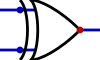

# Comp 273

> [cs.mcgill.ca/~jvybihal/](http://cs.mcgill.ca/~jvybihal/) &bull; [TA Information](https://docs.google.com/spreadsheets/d/1mKpXd_7QHxUuO6tqi3UbeZmuEPN3Lk-W68MPcIN-gkQ/edit?usp=sharing) &bull; [Textbook (4th ed, Right click to save)](http://nsec.sjtu.edu.cn/data/MK.Computer.Organization.and.Design.4th.Edition.Oct.2011.pdf)

[Terms & Concept Cards Here](https://www.allanwang.ca/notes/mcgill/comp273/practice/) <!-- TODO update>

## Circuits

The following diagrams were drawn with [Digital](https://github.com/hneemann/Digital). Feel free to download it to test the [circuits](circuits) directly.

---

Gates

| | NOT | AND | OR | XOR | NAND | NOR |
---|---|---|---|---|---|---
A | B |  |  |  |  |  | 
0 | 0 | 1 | 0 | 0 | 0 | 1 | 1
0 | 1 | X | 0 | 1 | 1 | 1 | 0
1 | 0 | 0 | 0 | 1 | 1 | 1 | 0
1 | 1 | X | 1 | 1 | 0 | 0 | 0

---

RS Flip FLops

Basic reset set flip flop to save bit data; a clock can be connected to the inputs of both nor gates for synchronization

R | S | Q | Q' | Result
---|---|---|---|---
0 | 0 | Q | Q' | No change
0 | 1 | 1 | 0 | Set
1 | 0 | 0 | 1 | Rest
1 | 1 | 1 | 1 | Avoid

---

D latch

An addition to the RS flip flop to accept a single input. Together with the clock (E), the input (D) directly changes the output of the latch. This also eliminates the Reset = 1 & Set = 1 issue.

E | D | Q | Q' | Result
---|---|---|---|---
0 | 0 | Q | Q' | Latch
0 | 1 | Q | Q' | Latch
1 | 0 | 0 | 1 | Reset
1 | 1 | 1 | 1 | Set

---

JK Flip Flop

JK flip flops cycle at half the speed of its input, as only one SR flip flop is enabled at a time and it takes two clicks to pass data to the output.

J | K | Q | Q' | Reseult
---|---|---|---|---
0 | 0 | Q | Q' | Unchanged
0 | 1 | 0 | 1 | Reset
1 | 0 | 1 | 0 | Set
1 | 1 | Q' | Q | Toggle

---

Multiplexer

Takes many input signals and a selector address with its own signals. Selector address chooses which of the input signals to output (by index).

A | B | Y
---|---|---
0 | 0 | D0
0 | 1 | D1
1 | 0 | D2
1 | 1 | D3

---

Half Adder

Adds two bits and returns the sum and carry; used for the least significant digit of numerical additions

---

Full Adder

Adds three bits (includes carry) together and produces a sum and carry; can be strung together to add numbers with many digits.

## Lecture 0 • 2017/01/06
* System board parts
  * Power Supply – Converts AC/DC from home into steady current needed in PC
  * CPU – Central Processing Unit – Math, logic, data, movement, loops
  * CMOS – complementary metal-oxide semiconductor – stores BIOS (basic input/output system) settings of computer
  * ROM – Read Only Memory – Stores built-in instructions (eg CMOS) & additional instructionss for CPU
  * Battery – Helps keep CMOS parameters, including time
  * RAM – Random Access Memory – Volatile main memory bank, large & slow
  * Cache – fast memory (pipeline) connected to RAM
  * Bus – Common road for data that interconnects all devices on motherboard
  * CLK – Clock – Beats the processing cycle (2 of them)
  * Slot – Connects devices external to motherboard through cards
  * ISA – Instruction Set Architecture – provides commands to processor to tell it what it needs to do (eg ADD, COMPARE, LOAD, OUT)

## Lecture 1 • 2017/01/09
* Traditional system board schematic has one bus connecting cache, CLK, CPU, ROM to RAM
* Having more buses allows for multithreading
* Slots allow connections to external devices
  * PCI (peripheral component interconnect), ISA (instruction set architecture)
* CLK – clock – one controls bus, one controls CPU (min 2 CLKs per device)
  * CLK for bus is one or two orders of magnitude slower than CPU CLK
* PCI can run at higher clock speeds
* Data bus – connects CPU to Cache
* Addressing – every component on system board has a unique integer number that identifies it
  * Eg opening & closing of gates towards various components that control data passage.
* Communication Pathways
  * Composed of multiple wires, each wire for 1 bit
  * In parallel, independent execution
  * One byte per bus per tick
* Bus
  * 8 wires
  * Grounded on both sides
* How would a 10 byte string travel from RAM to a slot, assuming traditional system board
  * Assume CPU is not present
  * Supervisor opens gates 0 & 1 and closes all other gates
  * Wait for tick
  * One char pass
  * Go back to step 2
  * Supervisor closes all gates
* If single byte in RAM & single CPU instruction in RAM both need to exit RAM at same time (one to CPU, other to slot), what do we do? Assume traditional system board
  * Not possible; one bus can only carry one process at a time
* In traditional system board, what would happen if the CPU & slot need to save a single byte into RAM at the same time?
  * Like before, we only have one bus. We’ll either lose data or one of the processes has to wait
* CPU
  * ALU – Arithmetic logic unit: + – > < == etc
    * L, R, A-out & status are specific purpose registers
      * L & R – inputs to ALU
      * A-out – result of operation
      * Status – input & output flag bits
        * input to tell what operation to perform
        * output to report errors (eg overflow, divide by zero)
  * Registers – Fast live memory locations
    * N general purpose registers 8, 64, or 128 bits long
    * Temp variables for CPU
  * IP – Instruction pointer, aka IC (Instruction counter) – points to next instruction
  * IR – Instruction register – stores current instruction
* Cannot distinguish variables, addresses, operations
  * Instructions usually have different OP-codes depending on data types
* CPU loop
  * Get instruction: IR &larr; RAM (slow bus, no cache)
  * Sequencer &larr; IR[OP-CODE]
  * Selected gates open
  * Clock ticks
  * All gates close
  * Increment to next instruction

## Lecture 2 • 2017/01/11
* Bit – machine 5V ≡ 1, 2V ≡ 0, 0V ≡ OFF
* Pathway – voltages can be passed through wire; whole wire becomes given voltage
* Bus ≡ n-wires ≡ one “unit” of Data
  * Also a pathway (of n going in the same direction)
* Gate
  * Has in and out direction
  * Freezes if other direction used
  * Computer freezes because of infinite loops or electricity going the opposite direction
* CPU
  * Fast bus, fast clock
  * IP – instruction pointer – keeps track of where we are in a program
    * Loaded into/used with address register
  * IR – instruction register – sends instruction to sequencer
    * Received from data register
    * Eg application opened &rarr; instructions sent to RAM &rarr; instructions sent one at a time to CPU
  * Seq – sequencer – opens all gates
  * CPU Clock
    * Beats to move data across CPU bus or move code from IP to sequencer
  * Sequencer
    * Table of codes with circuits
    * Each circuit is system of gated triggers
    * Triggers permit data to flow in predetermined order
* CPU Loop
  * IR &harr; RAM[IP]
  * IR &rarr; Seq, IP+
* Data – information
  * Eg characters, symbols, numbers
* Real data translated to code using properties of medium
  * Which medium should we pick?
bulletTablePair("Real Data &rarr; Numbers", "Encoded Data &rarr; everything else", 20),
  * INT ≡ Binary
* ISO IEEE
* RAM access register system
  * Allows communication between CPU & RAM
  * Address register – where to get/put data
  * Data register – where to put the data, or the data to put elsewhere
  * Mode register – flag for get or put
  * Zero page – like a sourcebook table; data should not overwrite things here
    * Bigger zero page &rarr; more stuff pluggable into machine
* CPU Boundary Register – keeps track of addresses used; addresses requested must never be greater than boundary address

## Lecture 3 • 2017/01/16
* Claude E. Shannon
  * Entropy – how much work does it take to communicate one letter to someone?
  * Medium – how can we transmit that single letter?
  * Realization – the medium is the message
  * In computers
    * Entropy – how many bits do we need to represent a single character?
    * Medium – Light (optics), sound (WiFi), signals(wire)
    * Realization – message is characterized by medium
* RAM
  * Usually, register size = address size
* Two types of basic information
  * Table encode – address/variable name on one side, data on the other (in bytes)
  * Natural binary number
  * Addressing schematic
    * Address column (32 bits) with cell addresses
    * Data column (8 bits) with OS, video buffer, program space, zero page
* ROM – read only memory – often sits between RAM and another part of the machine
* C – char a = ‘b’		compiler → w/ ASCII table → to byte
* Binary – size – register, RAM
  * Register – left most significant, right least significant
* Data = choice = cost
  * Having the leftmost bit hold the sign reduces the space for the actual numbers by two
  * A way to “double” the max integer would be to keep it unsigned

## Lecture 4 • 2017/01/18
* ASCII/UNICODE – unsigned bit (no sign bit), 8-bits long
* Char x = ‘A’	00100001
* Strings – contiguous sequence of characters terminated by NULL or contiguous sequence of chars proceeded (example had count in the front?) by a byte count
  * Composed of char
  * Char is built in property of CPU, not strings
  * Strings supported through software

* Integer
  * Number is represented in raw signed binary or 2’s complement for the bit size
    * 5: signed 00000101	2’s comp 00000101
    * 5: signed 10000101	2’s comp 10 – 5 ≡ 10 + (-5)
  * Start: 00000101
  * Flip: 11111010
  * Add 1: 11111011 &larr; -5
* Fixed Point – sign | exponent | mantissa (not two’s complement)
  * Bias is the 0, offsets up for positive, down for negative
  * ∵ all fixed point numbers are written as 1.xxx, \"1.\" May be deleted &rarr; extra bit &rarr; double the range
  * IEEE format

    Precision | Sign | Exponent | Fractional Mantissa | Total | Bias
    ---|---|---|---|---|---
    Single | 1 | 8 | 23 | 32 | 127
    Double | 1 | 11 | 52 | 64 | 1023
    Quad | 1 | 15 | 111 | 128 | 16383

## Lecture 5 • 2017/01/23
* Logic circuits
  * Circle &rarr; not
  * Extra line &rarr; exclusive
* nand &rarr; not and, nor &rarr; not or, xor &rarr; exlusive or
* For two overlapping but disconnected wires, draw a small bump at the intersection
* And gate is like a door with a lock – putting 0 on one end will stop the other end from passing through
* Or gates can pass data as soon as one side has 1
* Bit set reset, 1 &rarr; set &rarr; write 1, 0 &rarr; reset &rarr; write 0
* RS Flip-Flop
  * R &rarr; reset, S &rarr; set
  * Constructed by feeding outputs of two NOR gates back to each other's input
* D Latch
  * D &rarr; data
* RS Flip-flop with preceeding and gates and one inverter
  * Requires only one data input
  * Input from D results in that value as output for Q
  * Also includes clock input C
    * When C is 0, and gates used to pass inputs are 0, so no change occurs and Q holds its values
    * When C is 1, D value is passed through and set

## Lecture 6 • 2017/01/25
* End goal is addres &harr; read/write &harr; sync
  * Solution is gate/lock, eg and gates around SR flip flop
* To retrieve/send to correct address, use and gates with negations to check for matches.
* JK flip flop – two RS flip flops w/ clock and other gates
  * Adds a delay to output (first flip flop changes when clock is 1, other one outputs when clock is 0 &rarr; half the outputs as input)
* Half adder only contains A and B inputs
  * When doing addition, only least significant digit is half adder, others are full adders as there are carries
* Full adder = two half adders glued with or gates
* Status register has a few bits for unusual situations &rarr; overflow, dividing by 0, sign change
* To build an ALU, we need to know size of inputs and outputs, format, etc
* How would ALU design change when upgrading?
  *  4 &rarr; 8, adding 4 more full adders
* Subtraction – need to decide how we are doing the operation
  *  5 – 3, 5 + (-3), 5 + (3 * -1)
* ALU has its V like shape because there are 2’s complement holders for L & R followed by operation section
* Reminder: 2’s complement – invert all bits and add 1

## Lecture 7 • 2017/01/30
* Making a calculator: get method to check which digit you need, then turn on appropriate sections accordingly.
* Multiplexers 2a-to-1 mux has 2a inputs x0, … xn-1 & single output z. 
  * Selector address ‘a’ composed of input signals y0, …, ya-1 selects which xi signal passes through z
  * Like a router &rarr; multiple data, has to take turns
* Decoder – a-to-2a decoder asserts one and only one of its 2a output lines
  * CPU sequencer is decoder
  * Input is an index; outputs signal on wire of that index
* Encoder – outputs an a-bit binary number equal to index of single 1 signal among 2a inputs
  * Input from one of the wires; outputs index of that wire
  * Active output used to tell if x0 is ON as compared to an encoder that is off (otherwise both would be 0000)
* Programmable Combinatorial Parts
  * Type 1 – VIA fuses can be “blown” given sufficient current
  * Type 2 – VIA anti-fuse “sets” given sufficient current (chemical)
  * Drawn as a square, becomes circle 
* Blown fuses connects the wires?
  * Fuses represented by square
* !!!ROM & PROM shorthand
* PROM – programmable read only memory
* PAL – programmable array logic
  * Pairs that go down
* PLA – programmable logic array
  * Individual lines and or gates forming a hash
  * Both arrays programmable

## Lecture 8 • 2017/02/01
* Encoder/Decoder (see previous lecture)
* Von Neumann Machine – traditional computer model based on Turing’s theoretical ideas
  * Model: RAM (input) &rarr; Processor (Get instruction) &rarr; Execution with control unit &rarr; RAM (output)
* Index: MAR – memory address register, MBR – memory buffer register, D0-7 Registers, ALU – arithmetic logic unit, INC – incrementer, PC – program counter, IR – instruction register, CU – control unit, in ram {Mode, AR – address register, DR – data register}
  * Start with IP/PC (same thing)
  * Address in PC sent to address register (MAR &rarr; AR)
  * Sends to DR then to buffer (D0 to D7) – buffer may can contain data or instructions
    * Depends on MBR
* Every instruction in binary has two parts; OP code and address (or something else)
  * Only OP code goes down to control unit
* IR is basically a “dead end”	address will move onto PC, which will increment itself then write into MAR &rarr; DR &rarr; MBR (overwrites previous content) &rarr; next set of instructions
* CPU loop
  * AR &larr; PC
  * PC &larr; PC + 1
  * DR &larr; RAM[AR]
  * IR &larr; DR
  * Each line involves one tick (some improvements, like incrementation on same tick)
* Micro Instruction – way to express CPU operation step by step
* [ ] for index like arrays, ( ) for arguments
  * IR(OP, params)
  * &larr; indicates move
* BUS – Address, R/W, Data
  * 1 bit/wire, bottle neck, duality of operation (modes)

## Lecture 9 • 2017/02/06
* An instruction can be any size (ie 8, 16, 32 bits) depending on the CPU
* Bite – flip flop
* Byte – 8 flip flops – standard size for RAM
* Word – standard size for CPU
* Address – standard size for bus
* Registers – either Byte, Word, or specialty sizes
* Ports, slots, other important registers – Often \"accessible\" but not \"addressable\"
* At least now, sizes should agree with each other
* BUS – conduit for bytes to travel from one location to another (pathway)
  * In buses, address and R/W signals are only 1 way; data however is 2 ways, and is sometimes designed as 2 buses
  *  1 bit per wire
  * Bottle neck; 1 byte of data per movement
  * Duality of operation: byte & word modes
* Program (assume 8 bit instruction set)
  * | | |
    ---|---
    MOV D0, D1 | D0 &larr; D1
    Add D1, D0, 5 | D1 = D0 + 5
    MOV D0, X | D0 gets x from RAM
* Run Program
  * OS – double click, load to RAM at free space, PC &larr; 50
* Program Runs (OS is sleeping; number on top right denotes address)
  * MAR50 &larr; PC50   PC51 &larr; PC + 151
  * AR50 &larr; MAR56   DR &larr; RAM[AR]
  * MBR &larr; DR   IR &larr; MBR   CU &larr; IR (op code)
* OP code &rArr; code # represents instruction
* Bottom left wires go down to CU
* Args is complicated; sometimes have one, two, three, etc
  * For our example, there are always 3 arguments
* Comment: no real difference b/t integers and addresses; just how we use it
* Need code for all instructions?
* Each instruction from set is mode of micro-instructions
  * ADD, D1, D0, 5 &rArr; D1 = D0 + 5
  * Micro
    * L &larr; D0
    * R &larr; 5
    * A &larr; ALU(L,R)
    * D1 &larr; A

## Lecture 10 • 2017/02/08
* Midterm – definitions, circuit drawing/interpreting, data conversions & representation, RAM, adder, addressing, bus, IR, IP, classical & pipeline CPU, off the shelf circuits, mathematical problems as seen in assignment
* Pipeline as optimized architecture – clock tick sharing
  * CU needs to make sure it goes through all the right loops
* In pipeline, cacheinput &rarr; … &rarr; cachedata at 2GHz. It is connected to RAM via a slow bus, but to make use of the speed, there are private fast buses going from the RAM to the cache input and data. They operate at 2Ghz + dump, meaning they collect data and send a bunch at once.
  * Code/load prediction – dumb vs smart (looking one instruction ahead to see when to dump)
* Fetch portion of CPU
  * PC goes to read address &rarr; instruction comes out
  * Instruction R-format
    * OP – op-code (two; one for each CU)
    * RS – register source
    * RT – second register source (optional)
    * RD – register destination
    * SHAMT – shift amount (jump)
    * FUNCT – function-code (ie sub-op-code)
  * Add portion is always connected to 4, as instruction is 32-bit
* Load portion of CPU
  * OP code goes to CU, other parts of instruction go to registers, some portions skip register altogether
  * Multiple address registers exist so you can fetch and load from multiple addresses at the same time (unlike in RAM where it’s synchronous)

## Lecture 11 • 2017/02/15
* No restrictions in classical CPU relative to pipeline CPU
* Since bus goes in one direction, we must impose restrictions on the language
  * All instructions are 32 bits, all instructions pass all of pipeline, even if not needed
* Buses can be made wider to accommodate more instructions per second, but get more expensive while doing so
* OP-code register much smaller than other registers, since only part of the instructions are OP-codes (let's say an OP-code is 5 bits)
  * All valid values are mapped; using and gates, it is very much like doing an address
  * OP-code for ADD R1, R2, R3, and ADD R1, R2, c (where c is the value, not an address) are different, and will be interpreted differently
  * Using mux, we can choose the inputs we want to compute the result
  * CU is wired to all the components, controlling which data passes through
* Can't add 2 constants, but we can load one and store it, then load the other
* Every address has its own pathway
* When making CPU, we want to pretend that there's only one instruction, execute it, then merge everything in the end
* Multi-Purpose ALU
  * Load/store – compute memory address
  * R-type – AND, OR, Sub, Add, set-on-less-than
  * BEQ – uses subtraction
  * Managed by 3-bit ALU operation lines
* In code, conditions are associated with jumps
  * Save, load, add &rarr; complex conditions & jumps &rarr; cont.

## Lecture 12 • 2017/02/20
* We have to pretend that there are multiple IRs, even though there is only one
* Imagine a bunch of commands, each with its own shape (if you look at table, families of commands have similar shapes)
* Example
  * OP dest source const fn (haven’t talked about this yet)
  * ADD R1, R2, const
  * 00001 00001 00010 0011 ?
* All registers 32 bits
* Pipeline addresses by 32
* CPU & registers support 32 bit buses
* Instructions are 32 bits, but we cannot store 32 in IR since there are other components
  * Solution is sign extension
* To keep multiple instructions simultaneously, think of the 32-bit IR as 32 flip flop segments
  * Pretend that they have wires coming out and splitting into many more registers
  * However, we only want one instruction turned on at a time &rarr; AND gates
  * CU picks which one to turn on – decoder
* CU components
  * Each bit in OP in IR is connected to an OP register in the CU
  * Also has a counter and an incrementer to loop through all the needed data 
  * Simple pipeline: PC &rarr; A &rarr; CI &rarr; B &rarr; Reg &rarr; C &rarr; ALU &rarr; D &rarr; CD
  * Instructions often need many ticks to execute (ie ADD needs 4 ticks in classical CPUs)
    * | | |
      ---|---
      L&ensp; &larr; R3 | 00
      R&ensp; &larr; R2 | 01
      A&ensp; &larr; L+R | 10
      R3 &larr; A | 11
    * Works really well if all instructions have 4 ticks
  * Wires from OP and count come down
* Datapaths – wires of CPU needed to be engaged during an instruction
  * Includes path connecting registers, gates, ALU, etc
* Control – portion of CPU – aka CU/sequencer – responsible for timing & triggering of datapath
* Instruction Format – organization of bits in IR
* Micro-programming – datapaths that implement the instruction
  * Flat – one instruction executes at a time
  * Pipeline – 1+ instruction at a time
  * Cores – parallel execution

## Lecture 13 • 2017/02/22
* Hazard – danger to keep watch for
  * Structural – CPU cannot support combination of instructions in pipeline (eg single instruction store/load crash)
    * Illegal instruction or illegal result (like divide by zero)
  * Control – branch request causing semi execute pipeline instructions to be unnecessary
  * Data – instruction depends on results of previous instruction in pipeline
    * NOP/wiring for forwarding/backup buffer
* Fault – error that has occurred
  * Can lead to stall – lengthened CPU cycle
    * Can lead to dump – all instructions dumped from pipeline & re-loaded after fault is handled (major slow down)
    * Or no-op – additional instructions without actions inserted between fault & next instruction to allow CPU to execute problematic instruction without side-effects (minor slow down)
  * Or crash – program is killed and stops
* Eg dividing by 0
  * MUX with inputs from INC & OS REG
  * Stops incrementer if dividing by 0, looks at error register to find out why
* If else
  * Requires a jump, but other instructions are already queued up
  * Delete, dump &rarr; pipeline loses those nanoseconds
* While loop requires a jump every time
* Pipeline structure
  * PC, Jump, CI, Compare, R, Move, ALU, Add, CD
* Calculating loss
  * Expected(Loss) = P(Loss) * Cost
  * Average stall is 17%; depends on the program
  * Solution – predictions
    * Assume branch will always fail (not used)
* Happens too often
    * Assume branch success based of type
* Function calls (yes)
* Backward jumps (probably loops, yes)
* If statements (no, fail)
    * Reorder instructions (compiler solution)
* Need delay to figure out if branch will happen
* Instead of NOP, reorder branch & preceding instruction
* Eg
  * Original
    * Add \$4, \$5, \$6
    * Beq \$1, \$2, 40
    * Lw \$3, 300(\$0)
  * Reorder
    * Beq \$1, \$2, 40
    * Add cache, \$5, \$6
    * Lw \$3, 300(\$0)
* Clock ticks – count of number of actual clock ticks required to perform activity in CPU
* Cycles – count of number of micro instruction required to perform activity in CPU
  * Important for pipeline, based on instructions; ticks are universal
* CPU Execution Time is product of…
  * Instruction count (total # of instructions in program)
  * Clock cycles per instruction
  * Clock cycle time
  * In other words, # instr/program * # ticks/instr * # s/tick

## Lecture 14 • 2017/03/06
* Sending address
  * Tick from PC to MAR
  * Tick from MAR to AR
* Retrieving data
  * Tick from RAM to DR
  * Tick from DR to MBR
  * Tick from MBR to IR
* During 5 ticks, PC is incremented; it’s always ahead
* CU has copy of OP code & count
  * Count increments & clears itself
* Chip Set
  * “on die” – on CPU die
  * “on board” – on system board, commonly near CPU
* CPU System supports OS Registers, System-board registers, and Chip-sets
  * Co-processors – eg math, matrix, graphics GPUs
  * ROMS – built-in support for video & basic graphics, ASCII support, communication ports, basic peripheral support
* Chip sets have private buses connecting to CPU
  * Multiple co-processors may exist to deal with crashes
  * May have special assembler instructions
* CPU constraints
  * Operating system – secure environment; programs should not interfere
    * Have an upper and lower bound for valid pointers
* OS Boundary Register – prevents process’s PC from addressing into OS space
* Internal CPU exception handling
  * Reasons
    * Incorrect machine language binary
    * Arithmetic – overflow, divide by zero
    * Incorrect address reference
  * Supporting registers
    * EPC – exception program counter register – address of bad instruction
    * Cause – error code
    * Jump to reserved internal cache memory address for exception assembler code
* Interrupt – signal sent to overwrite/swap PC with trap’s pointer
* Multiplication
  * CPU’s ALU – integer operations: + – * /
  * Co-processor’s ALU – floating point operations: + – * /
* Grade school multiplication – multiply first number by each digit in the second number, and shifting them and adding them (just like how you normally multiply)

## Lecture 15 • 2017/03/08
* When typing on a keyboard, each key is mapped with a wire to a certain value. To make the values universal regardless of the wiring, a ROM can be used to convert it into ASCII. It is then passed to a register, then to the RAM/CPU. The ROM would be part of the chip set
* Notes about grade school multiplication (with binary values)
  * We do not need to wait to do the sum; product result shifts left naturally
  * If multiplier is 1, copy the multiplicand
  * If multiplier is 0, result is 0
  * Integer multiplier hardware
    * If multiplier bit is 1, sum multiplicand with product & shift left
    * If multiplier bit is 0, shift left multiplicand
    * Eg 0b1101 * 0b1100 = <s>0b1101</s> + <s>0b11010</s> + 0b110100 + 0b1101000 = 0b10011100
  * Multiplication procedure for a * b; let p = product
    * If (smallest bit in a == 1) p += b
    * b << 1, a >> 1
    * repeat for each new smallest bit ‘a’
  * Hardware improvement
    * Multiplicand & multiplier are 32 bit registers, and product is 64 bit register
    * Product register is right shifted rather than shifting multiplicand (b) left
    * Answer is right most 32 bits
    * Bits passed the mid line in the product do not need to be added again
    * No multiplier register; multiplier is placed in answer part of the product
* Types of Computers
  * Single CPU – single CPU chip of any type (flat, pipeline, hyper threaded)
    * No cache
  * Multi-CPU – more than one CPU chip of any type
  * Single Core – optimized single CPU chip
    * Bridge connects core with rest of system board
  * Multi-Core – single CPU chip with multiple processors
    * Bus interface is shared; permits same data for all cores
* Program – compiled algorithm stored on disk
  * Has OS loader & static components
* Process – executing version of program in RAM
  * Has static & dynamic components
* Thread – instructions currently executed by CPU
  * One process may have many threads
  * Each thread is instance of process
  * Multithreading for multiple CPU
* Cores allow for many functions to be executed simultaneously, but require more effort to communicate with each other. The more cores we have, the more the advantages disappear.
* Core is treated as unique processor, managed by the OS
* To run one process with 2 threads on a quad-core, the OS can
  * Use 2 cores to run threads simultaneously
  * Use 1 core & task switch between threads
  * Queue process & threads for later as high priority code is executing on all cores
* OS – operating system
  * Core management
    * Special purpose core assignment – reserve cores for specific uses (eg OS code on core 1)
    * Dedicated application assignment – application attached to core (eg browser on core 2); core is shareable with other processes
    * Core pooled assignment – cores not dedicated to anyone; managed by queue
  * Management types
    * Simple – queue processes, assign to cores, after n ms release cores and repeat
    * Complex – one process has multiple threads; may need to share data so is placed on a core that can do so
* Multi-core helps keep work flowing; we are limited to how much we can increase speeds for individual cores
* How unique is each thread?
  * 1 thread/program – we behave this way; everything executes at same time
  * N threads/program – eg browser with multiple windows
    * Needs to coordinate/synchronize, which causes overhead
    * When N > 6 effects overcome speed improvement
* TLP – thread-level parallelism – multi-core strategy – each core given portion of program to execute
  * Games – core 1 AI, core 2 graphics, core 3 physics, core 4 UI
  * Business – core 1 web server, core 2 database server, core 3-4 system processing
  * Personal computer – core 1 OS, core 2-4 user programs
  * Science – core 1 OS, core 2 data acquisition device, core 3 data analysis device, core 4 other
* SIMD – single instruction multiple data
  * Eg modern GPU
  * Have matrix of data; single instruction executed on all cells in matrix of data at same time
  * Each matrix cell is actually a core
* MIMD – multiple instruction multiple data
  * Eg multi-pipeline CPU
  * Pipeline architecture per core, sharing same RAM
  * Each core has own instruction & data cache
  * Core alone is single instruction/data; chip as a whole is multiple instructions/data
* SMT – simultaneous multi-threading
  * Eg integer ALU is busy, fixed-point ALU is empty; process wanting integer waits & process wanting fixed-point runs
  * Multiple independent threads execute simultaneously on same core
  * Threads can run concurrently but cannot simultaneously use same functional unit
  * Not true parallel processor
    *  > 30% threading
    * OS sees virtual processor
    * Does not have resources for each core like multi-core
* Hyperthreading – combining SMT with multi-core (single-core non-SMT, single-core SMT, multi-core non-SMT, multi-core SMT)
* Memory types
  * Shared – large common memory shared with all processors
    * L2 cache (sometimes private), L3 cache, RAM, in simultaneous multi-threading
  * Not shared – pipeline, L1 cache private
  * Distributed – each processor has own small local memory; not replicated elsewhere
* Cache types
  * Private – closer to core &rarr; faster access; less contention
  * Shared – more space available for big instructions/data programs
* Contention – more than one core needs access to same cache
  * One core waits; needs circuity to handle competition (small CPU slowdown)
* Cache coherence problem
  * How do we keep private cache data consistent across caches?
  * Invalidation + snooping – record addresses being used, record MAR used, issue fault when necessary to retrieve correct data
    * Invalidation – core writes to cache &rarr; other copies flagged invalid
    * Snooping – cores monitor write operations

## Lecture 16 • 2017/03/13
* [MARS download](http://courses.missouristate.edu/KenVollmar/MARS/download.htm)
* Some instructions go directly through zero page or special pathways (eg to co-processor)
* CPU has protection schemes
  * Privileged – all registers protecting OS accessible
  * Non-privilege – limited to lower & upper boundaries
    * Cannot access other processes, OS, zero page, system resources
* Compiling: source code &rarr; compiler &rarr; assembler &rarr; (with library & loader) &rarr; linker &rarr; executable
  * Assembler verifies syntax & converts to machine code (eg .o file in c)
  * Linker verifies library calls exist & merge library code into program; special OS functions added from loader
  * Executable is a complete machine compatible file, assuming CPU & OS interface matches
* Programs execute when
  * Source code version == that of compiler
  * Machine code output == CPU instruction format
  * Programs’ loader version == OS API on computer
* Assembler directives
  * Comments: #
  * Directives: .COMMAND
    * .text – source code segment
    * .data – data segment
  * Labels: LABEL: or LAbEL
    * LABEL: – define label’s location
    * LABEL – references label location
* Assembly
  * Pass 1 – building symbol table
    * Contains labels and where they are in the address
    * Base address points to first instruction in program, undetermined
    * True value is given by OS after program is launched
    * Remaining address values are offsets after x
  * Pass 2 – machine code generator
    * Contains address and instruction at that address
    * From pass 1, all addresses are offsets from ‘x’
* Instructions have different classes (name, bit location in brackets)
  * R-type – OP code 0 (31-26), rs (25-21), rt (20-16), rd (15-11), shamt (10-6), funct ALU op (5-0)
    * Eg add $t1, $t2, $t3
    * Bit order: OP code (0), $t2, $t3, $t1, shamt, add
    * 000000 00010 00011 00001 00000 100000
  * Load/store – 35 for load, 43 for store (31-26), rs (25-21), rt 43 for source, 35 for dest (20-16), address (15 – 0)
  * Branch – breq 4 (31-26), rs (25-21), rt (20-16), address (15-0)
  * Jump instruction – 2, address

## Lecture 17 • 2017/03/20
* Virtual memory usage
  * MIPS uses byte addresses
  * Words are 4 bytes
  * Memory holds data structures, spilled (saved) registers, instructions, variables, & constants
  * Bottom of stack is 7fffffffhex
  * Programs start at 400000hex
  * Ascending, contains text segment, data segment, stack segment
  * Stack & data segments are shared space and can crash (overlap)
* MIPS format is RISC – reduced instruction set computer
  * Use series of simpler instructions rather than complex ones that take more ticks
* Addressing modes
  * Register addressing
    * Operand is register
    * Eg add $s1, $s2, $s3
  * Base/displacement addressing
    * Operant is memory location
    * Register + offset &larr; constant
    * Eg lw $s1, 100($s2)
      * AR &larr; 100 + $s2
  * Immediate addressing
    * Operand is constant (16-bit)
    * Eg addi $s1, $s2, 100
  * PC-relative addressing
    * Mem location = PC + offset &larr; constant
    * Eg j 2500 or j label
  * Pseudo-direct addressing
    * Mem location = PC (top 6 bits) concat with 26-bit offset
    * Assume 32-bit addressing
    * Eg jal 2500 or jal label

## Lecture 18 • 2017/03/22
* # Much of this lecture was talked about in the previous lecture
* While(save[i] == k) i += j
  * Need to compute index i each time; use temp reg and add; for integers, go 4 bytes forward, or add to itself and do it again.
* Case/switch
  * Lots of branches with breaks each time.
  * Break not necessary for last case as it jumps to the same location
* Set less than
'-slt $t0, $s0, $s1 – $s0 < $s1 ? $t0 = 1 : $t0 = 0',
  * bne for conditions

## Lecture 19 • 2017/03/27
* Register based
  * Fast & easy, but limited # of registers & no local variable simulation
* Run-time stack
  * Very large & fits many parameters & can protect local variables, but it’s slower
'-Create room for the stack	subi $sp, $sp, 16',
'-Save variables starting from the back and moving inwards	sw $t0, 12($sp), … sw $t4, 0($sp)',
  * Call subroutine & return values assumed in v0/v1
'-Can protect registers by saving previous results in a stack (ie $t0) and then pop them afterwards',
'-After we are done, move stack position back (eg addi $sp, $sp, 28)',
* Global – no scope
  * Registers are loaded at run-time
  * Data is compiled &rarr; static
* Parameters & local variables don’t exist physically and are simulated in a runtime stack
  * Stack is global
'$fp refers to where $sp was before',
'-Do not let variables refer past $f0'

## Lecture 20 • 2017/03/29
* Floating point instructions
  * Add.s (single precision), add.d (double precision)
* Buffers
  * Eg Buffer: .space 2000
'-La $s0, Buffer',
'-Proceed to use $s0 reference',
* Syscall values
'-Load code instruction into $v0',
  * For arguments, preload them and the call will retrieve the values
  * | Service | System Call Code | Arguments | Result
    ---|---|---|---
    print_int | 1 | $a0 = integer
    print_float | 2 | $f12 = float
    print_double | 3 | $f12 = double
    print_string | 4 | $a0 = string
    read_int | 5 | | integer(in $v0)
    read_float | 6 | | float(in $f0)
    read_double | 7 | | double(in $f0)
    read_string | 8 | $a0 = buffer, $a1 = length
    sbrk | 9 | $a0 = amount | address(in $v0)
    exit | 10
* Elements
  * MIPS CPU support consists of
    * $gp, used like $fp to point to beginning of heap frame
    * System call, sbrk (syscall code 9)
      * Ask OS for n-bytes of data (like malloc)
      * Return address of first byte
  * Can simulate own heap with fixed memory block in data area
* Polling code
  * Continue checking for a condition and branching to recheck until that condition is met before continuing. Stalls the program

## Lecture 21 • 2017/04/03
* Devices generally have a cmd, data, & status register
* Devices that are always connected, eg a keyboard/display, have their own constant connections
* Machines with a different clock speed will interact with RAM in parallel, how do we synchronize the ticks?
* Polling – CPU waits for device (see lecture above)
  * Requires zero page
  * Checks the status – ready (sync), busy (ignore), error (stop)
  * Simple to write, but very CPU intensive
  * Useful when we need to wait for a user anyways
* Interrupt – hardware specific
  * In MIPS
    * Requires data, status, cmd, addr registers, and interrupt wiring
    * Give machine task, let it do its thing and send a callback when done
    * Address will point to a function in project
    * If !error && !body, data = …, addr = …, cmd = …
  * In OS
    * PC goes to MAR & INC
    * Another register contains constant, and that register & INC goes to PC
    * Another wire with an interrupt signal goes to PC
    * Other machines can send signal to switch the PC to the address that is being worked on
  * DMI/DMA – direct memory interface/addressing
    * Still connects CPU, device, & RAM to bus
    * Also wires device into RAM so it can download directly
      * Requires ROM, CLK, private bus, DATA, CMD, STATUS, COUNT, ADDR
  * If we need to wait for a user input, we can put the program to sleep until the input is received
  * Allows for multiprocessing
  * Since interrupts require time to send the correct data and address, if the interrupt cycles is very small, it may be more efficient to use polling

## Lecture 22 • 2017/04/05
* RAM is too big to be inside CPU, so we have it separate. The RAM clock is slow, so we have a cache in the CPU
* Cache size is less than RAM. To map it we can use modulo
* Locality
  * Temporal – item will be referenced again soon, eg libraries & functions
  * Spatial – adjacent items probably executed next, eg loops & functions
* Memory hierarchy (fastest to slowest)
  CPU registers | flip-flops | 1-5ns
  ---|---|---
  Cache | SRAM-transition + power | 5-25ns
  RAM | DRAM capacitors + refresh | 30-120 ns
  Disk | Magnetic charge-mechanical | 10-20 million ns
* How to optimally use cache?
  * Hit to miss ratio (cache miss rate) – hit implies we find instruction in cache; miss implies we need to go to RAM
  * If missed, we must access RAM, wait for RAM to complete, put data into cache  update table, then restart instruction from cache
  * Miss penalty = cycles to upload data to cache
  * Cost of miss = miss frequency * miss penalty
  * Program speed = n + m * penalty; n & m are # of instructions 
* Basic access architecture
  * PC divided into 3 parts
  * Recall in MIPS that each instruction is 4 bytes
  * No need to store the last two bits for each byte as we can assume it
  * Remainder of instruction is divided into unique | mod | 1/0 (which we ignore)
  * We store the full instruction as a word, and the unique portion as a tag
  * To retrieve data, we find the modulo, then use the tag to match with the proper instruction
  * There is also a bit defining whether a space is in use or not; keep in mind that when we “remove” an instruction, we don’t necessarily clear the bits, but can just say that it’s disabled
  * All matches result in a hit
* Performance calculation
  * Amdahl’s law – speedup in performance is proportional to new component & actual fraction of work it carries out
  * s = 1/[(1 – f) + f/k]&emsp;&emsp;Where s is speedup, f is fraction of work by component, k is advertised speedup
  * Eg – if processes spend 70% of time in CPU, and there is a computer that functions 50% faster, what is the speedup?
    * s = 1/[(1 – 0.7) + 0.7/1.5] = 30%
* Transfer rate calculations
  * Eg assuming polling overhead takes 400cs on CPU that runs 500MHz, where cs = 1 tick
  * How much CPU time is used for a hard disk transfer at 4-word chunks at 4MB/s
  * Polling = 4MB/16bytes = 250K times &rarr; 250K * 400 = 100 000 000
  * Processor = 100 000 000/500 000 000 = 20%

## Lecture 23 • 2017/04/10
* Independent device with clock & rom – waits for signal and executes instruction depending on input
* Connected to a register/buffer (with cmd, status, data, port)
* Connected to RAM which is connected to CPU
* To run: cmd passed to device, device runs &delta;t, status & data/buffer updated
* After polling is finished, data still has to be transferred from buffer to RAM
* Polling example: load 100 bytes, pass to device, wait
* Interrupt example: load 100 bytes, device handles the rest (no time taken in CPU), status received, bring data in
* Two ways of doing polling
  * Busy loop – while loop with condition
  * Intermittent loop – have checker in a function and check it with a timer (eg every 0.5s)
    * Can be useful for getting constant slow data, like keyboard input. Check at a time faster than the fastest typist
* Use interrupts for data that cannot be missed and data that comes at random times (eg internet data) – network card as a clock and does not need to use the CPU
* MIPS convention – a (params) & v (return) registers used for passing information; no stack
* ANSI C standard – stack based – push saved & local variables and pop later when needed
'-Note that popping doesn’t clear the stack; we just move $sp so that we may reuse the “cleared” addresses',
  * Return values are still added to the v registers
* Final exam format
  * Closed book, <b>scientific calculator allowed</b>, part marks given, teacher supplied help sheets (op codes, syscalls)
  * Questions
    * Definitions (~4)
    * MIPS programming (2)
    * Circuit drawing (~2)
    * Calculations (~4)
    * Bonus (2)
  * Topics
    * MIPS assembly
    * Circuit interpretation & building
    * MIPS features – caches, virtual & dynamic memory, recursion/stacks, interrupts & exceptions, memory mapped I/O, buses, synchronous vs asynchronous
    * Conventions for passing args & using peripherals
  * Things to know but aren’t tested – digital math & data formats
  * Things to know – Amdahl’s law, polling & interrupt overhead, cache performance