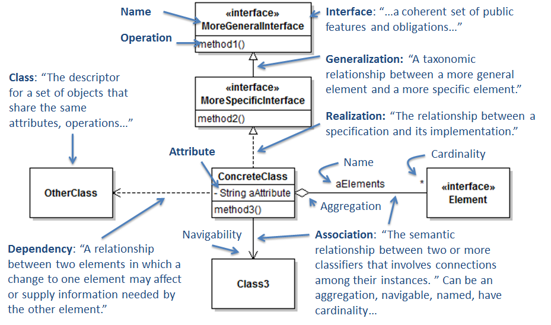

# Comp 303 Final Notes

For more notes on design patterns, see [here](https://github.com/AllanWang/Design-Patterns/blob/master/java.md)

# UML

> Unified Modeling Language

## Object Diagram

> For class instances

* Cards are labelled with `name:type`
* Values may be primitives or references pointing to other cards

## Class Diagram

> For static, compile-time view



<sup>Taken from [prmr/SoftwareDesign](https://github.com/prmr/SoftwareDesign)</sup>

| Label | Basic Meaning |
| --- | --- |
Generalization | extend
Realization | implements
Dependency | change in one will change another
Association | general relationship (eg fields); bi-directional if no arrow drawn
Aggregation | "has a/many" associative relationship
Composition | physical aggregation (typically, item in composition cannot exist without parent class)

Note that:
* Diamond is on the side of the container for aggregation/composition
* Aggregation/composition should indicate cardinality (eg `2`, `0..52`, etc)
* Elements represented through arrows should not be duplicated within the cards

## State Diagram

> For dynamic, run-time view

* Start denoted by black dot
* End denoted by black dot with circle
* States represented by cards
* Arrows denote transitions
    * Annotated as `name[condition] | action` (only name is mandatory)
* Lack of transition means that it is invalid

# Concurrency

```java
try {
    lock.lock(); //Reentrant Lock
    // do stuff
} catch (InterruptedException e) {
    // handle stuff
    return; // finally will still be called
} finally {
    lock.unlock();
}
```

# Serialization

```java
public class Data {

    private String name;
    private int count;
    private String value;

    /**
     * @param name  must not have a space
     * @param count
     * @param value must not have a space
     */
    public Data(String name, int count, String value) {
        this.name = name;
        this.count = count;
        this.value = value;
    }

    public static Data deserialize(String data) {
        if (data.charAt(0) != '"' || data.charAt(data.length() - 1) != '"')
            throw new IllegalArgumentException("data not in serialized form");
        String[] parts = data.substring(1, data.length() - 1).split(" ");
        return new Data(parts[0], Integer.parseInt(parts[1]), parts[2]);
    }

    public String serialize() {
        return String.format("\"%s %d %s\"", name, count, value);
    }

    public static void write(String path, Data... data) throws IOException {
        try (PrintWriter out = new PrintWriter(new FileWriter(path))) {
            for (Data d : data)
                out.println(d.serialize());
        }
    }

    public static Data[] read(String path) throws IOException {
        List<Data> data = new ArrayList<>();
        try (BufferedReader in = new BufferedReader(new FileReader(path))) {
            for (String line = in.readLine(); line != null; line = in.readLine())
                data.add(Data.deserialize(line));
        }
        Data[] result = new Data[data.size()];
        data.toArray(result);
        return result;
    }

}
```